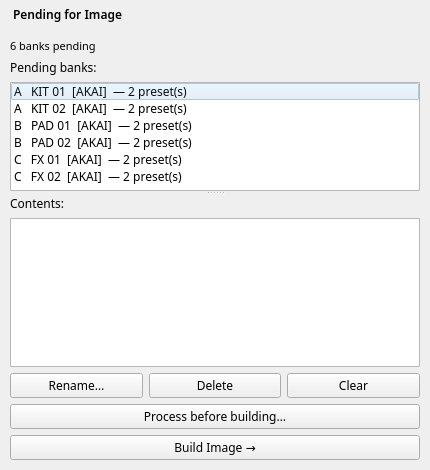
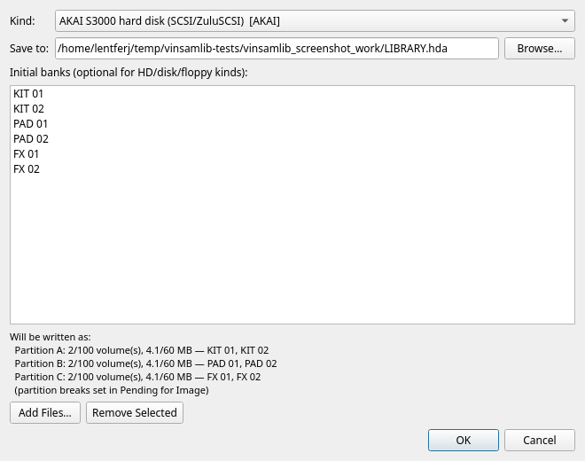
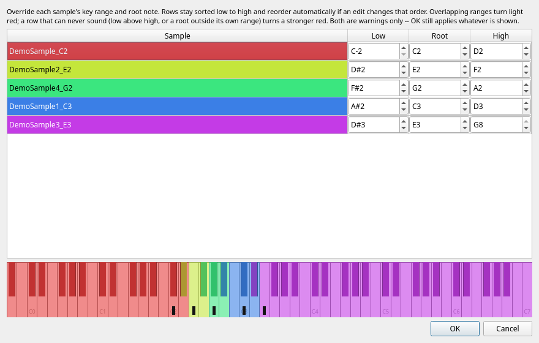

<!--
SPDX-License-Identifier: GPL-2.0-or-later
SPDX-FileCopyrightText: Copyright (C) 2026  VinSamLib contributors
-->

# VinSamLib

A librarian and bank builder for vintage sampler content — E-mu E4B
(Emulator IV / E4XT / EOS), E-mu EIII/ESI-32, and Kurzweil KRZ (K2000
series). Browse a whole library of banks, discs, and floppy images at
once; drag any preset or program straight into a new bank; queue
several banks for a build; write real, loadable disk images. Where
mpc2emu is available, you can also browse and import Akai MPC material
directly — a `.xpm` program, or a whole `.xpj` project one program at a
time — or run any existing preset through mpc2emu's vintage resample
/ sample-count reduction pipeline on its way into a bank.

> **Legal:** [DISCLAIMER.md](DISCLAIMER.md) · [LICENSE](LICENSE)

---

## ⚠️ Use at your own risk — back up first

VinSamLib is provided **as is, with absolutely no warranty and no
liability** for lost data, damaged hardware, corrupted media, or any
other harm arising from its use. You assume all risk. (Full terms:
[DISCLAIMER.md](DISCLAIMER.md).)

**Before you use this software, make good, current backups** of your
config, your library, and any existing disk images or floppy sets you
point it at. VinSamLib can rename, delete, and append entries on an
already-open disk image **in place**, and every Add/Remove Library
Folder action writes to your real config and search index immediately.
This isn't a hypothetical caution — an early ad-hoc test script during
this project's own development corrupted its author's real config and
search index once; see [DISCLAIMER.md](DISCLAIMER.md#real-data-risk--please-read-this-one)
for the honest account. Always keep an untouched copy of anything
irreplaceable, and test unfamiliar images on a spare SD card / floppy
before touching real hardware.

**Several fixed defects produced files that are wrong and do not look
it.** Most of them are `.KRZ` banks: ones whose programs use their own
effects or the K2000's ROM sounds, ones built from more than one source
bank, from a multi-disc source, or containing stereo samples — all fixed
2026-08-10 — plus velocity-layered ones built before 2026-08-09 and two
older kinds. Outside KRZ: anything converted from an E4B between 28 July
and 9 August, anything converted with a Vintage Resample profile from
stereo, and any large MPC multisample imported before 2026-08-04.
All are fixed, none can be repaired in place, and nothing warns you
about a file you already have: see [Fixed defects — check what you built
earlier](#fixed-defects--check-what-you-built-earlier).

---

## AI assistance & human authorship

VinSamLib was built by its human author together with Anthropic's
**Claude**. The **ideas, the feature set, and every design correction**
came from the human author, arrived at through real, iterative use —
not a spec written up front. Claude assisted with **writing the
implementation and the test suite**. Full account, including specific
examples of corrections that shaped the final design, in
[DISCLAIMER.md](DISCLAIMER.md).

---

## Features

### What it is, and what needs mpc2emu

VinSamLib is a **GUI librarian**, not a batch converter — it sits on
top of [mpc2emu](https://github.com/lentferj/mpc2emu) (a separate,
sibling project) for every disk-*image* writer and every DSP routine,
and never edits or vendors mpc2emu's code. **Without mpc2emu installed
or configured, VinSamLib is still a full E4B/KRZ bank builder and
library browser**, not just a viewer: parsing, assembling, and saving
banks (New Bank → Save as…) needs no mpc2emu at all —
`banks/e4b.py`/`banks/krz.py` are entirely self-contained — and
browsing *existing* E4XT (EMU3) discs/HD images, K2000 ISO 9660 discs,
and **FAT12/16/32** floppies/discs/HDs (K2000 Gotek floppies, EOS FAT
`.hda`s) all work natively too, via `vfs/fatvol.py`'s own from-scratch
reader against the public FAT spec — no mpc2emu involved even to read.
EIII sits between the two: `banks/eiii.py` *reads* EIII/ESI banks with
no mpc2emu at all, but assembling one needs mpc2emu for the empty-bank
skeleton it reuses. **Akai S1000/S3000** is fully self-contained on the
read and assemble side — browsing a sampler disc, listing its volumes
and programs, and building a new AKAI volume in New Bank all work with
no mpc2emu; only *converting* an AKAI program to another format does,
and only then. What genuinely needs mpc2emu: **creating or
appending to any disk image** (every image kind's writer lives there,
E4B/EIII and KRZ alike), **E4B/EIII** preset-level zone/velocity/
bit-depth detail in the Detail pane (KRZ's own detail view is
self-contained), building an EIII bank at all, XPM import, sample-folder
import, **browsing or importing the soft-sampler formats (SF2, SFZ,
EXS24, TAL-Sampler, GIG) — without mpc2emu those do not appear in the
Explorer at all**, converting an AKAI program, and vintage conversion.
Settings shows exactly which of these is unavailable and why if mpc2emu
isn't configured.

### Browse an Akai S1000/S3000 library

Point VinSamLib at an Akai sampler disc — a SCSI/ZuluSCSI hard disk
(`.hda`/`.img`), a CD3000 CD-ROM (`.iso`), or an 800 KB / 1.6 MB AKAI
floppy — and every volume on it lists as a bank, with its programs as
presets, keygroups and velocity zones in the Detail pane, and its
samples in the Samples pane. A folder of loose `.P3`/`.S3` files reads
the same way. Programs convert to **E4B, KRZ or EIII** through
Explorer's "Import via mpc2emu…", and can be dragged into New Bank to
build a new AKAI volume.

Reading needs **no mpc2emu at all** — `banks/akai.py` and `vfs/akai.py`
are VinSamLib's own, like the E4B and KRZ readers. Converting needs an
mpc2emu checkout that has AKAI support.

None of it is confirmed on real Akai hardware yet; see
[Known Limitations](#akai-s1000--s3000). The format was never published
by Akai, so every byte of it is reconstructed — this project reads
**real commercial library discs from a dozen publishers** — both S1000
and S3000, thousands of volumes — correctly, and writes nothing a sampler
has been asked to mount.

### Browse your whole library at once

Point VinSamLib at any number of folders — loose `.e4b`/`.KRZ` files,
EMU3 CD/HD images, ISO 9660 discs, FAT12/16/32 floppy or hard-disk
images, Akai sampler discs, folders of Akai MPC programs and projects —
and it lazily walks
the tree, showing banks, discs, folders, presets, and programs in one
unified Explorer. A background scanner indexes
everything into a local search database, so typing in the search box
finds a preset by name anywhere in the whole library, instantly, without
waiting for the tree to be expanded down to it.

### Build a new bank by dragging presets together

The New Bank column accepts presets/programs dragged from anywhere in
the library (or added via right-click), locks to whichever format the
first one came from, and shows a live, real size/count meter — computed
by actually assembling the selection, not an estimate. The E4XT's 128 MB /
1000-preset and the K2000's 800-objects-per-type limits are hard,
format-technical ceilings, always enforced; a separate, lower,
configurable-in-Settings byte threshold (default 64 MB E4B / 32 MB KRZ)
warns earlier, once a bank likely exceeds *your own* hardware's actual
RAM. For KRZ the meter shows two further figures the byte count cannot
express — **PRAM**, the object memory a K2000 loads into, and the number
of **references to ROM sounds**, which cost about 0.37 s each at load
time. Save the result directly to a
file, or queue it for image building.

Samples inside the bank can also be **renamed** before it is written —
individually, or all at once after the key each one plays — for E4B, KRZ and
EIII alike. ⚠️ **Experimental and not confirmed on any sampler**; see
[Known Limitations](#️-renaming-samples-inside-a-bank--experimental-not-hardware-confirmed)
before writing media you care about.

### Queue several banks, then build

The Pending for Image column holds any number of banks-in-progress;
each can be renamed, reordered, and independently given its own mpc2emu
conversion recipe before "Build Image →" assembles all of them into the
currently-open (or about-to-be-created) disk image in one step.

### Manage disc/floppy images directly

The Image column creates any of mpc2emu's own image kinds (EMU3 CD,
EMU-fs or FAT hard disk for the E4XT; FAT16 CD/hard-disk or FAT12 Gotek
floppy for the K2000), or opens an existing one, and lets you append,
rename, delete, and export individual bank entries in place.

### Import an Akai MPC program, or browse a whole project

When mpc2emu is available: double-click or right-click any `.xpm` file
in the library, choose a target format and optional vintage conversion,
and it lands in New Bank as a single preset, ready to combine with
anything else.

An MPC **project** (`.xpj`) holds one program per keygroup track, so it
is browsed like a bank: expand it in the Explorer and each program shows
up as its own row, with the same zone summary a real preset gets. Import
one program, or the whole project at once.

### Bring in SoundFont, SFZ, EXS24, TAL-Sampler and GigaSampler instruments

Also when mpc2emu is available: `.sf2`, `.sfz`, `.exs`, `.talsmpl` and
`.gig` files sit in the Explorer next to your hardware banks — indexed,
searchable, filterable, and draggable straight into New Bank. A SoundFont
or GigaSampler file expands like a bank, one row per instrument inside it,
so you can pull a single sound out of a 1 GB soundfont without importing
the rest. The others hold one instrument each and import as a single row.

**These are import sources only.** VinSamLib reads them and writes the
hardware bank you choose — E4B, KRZ or EIII. It never writes a SoundFont
or an SFZ, and New Bank will refuse to build one.

Expanding a soundfont does **not** read its audio: the instrument names
come out of the file header, so a 985 MB `.gig` opens in milliseconds.
Only an actual import parses the samples.

Instruments that cannot be converted still appear, greyed, with the
reason — most often a TAL-Sampler preset whose samples are encrypted
`.talwav` files, which nothing outside TAL-Sampler can decode.

### Run an existing preset through mpc2emu's vintage pipeline

Right-click any real preset or program in Explorer — E4B, KRZ or EIII —
for a second option, "Import via mpc2emu…", offering the exact same
resample/reduce dialog XPM import uses: apply the EMU Emulator II or
Emax I character, thin out an overly dense multisample, or convert to
another format entirely, without leaving VinSamLib. The dialog
defaults its target format to the preset's own source format, so
"same format, with options" (apply processing without converting) is
one click away — the same "Add" a plain drag would do, plus optional
processing.

### Turn a folder of WAVs into a multisampled preset

Also when mpc2emu is available: **File > Import Sample Folder…** takes a
folder of loose WAVs whose filenames carry their root notes
(`Piano C3.wav`, `Cello-A#2.wav`, `Pad_60.wav`) and auto-maps each one to
the keys nearest its root, producing a single playable multisample in New
Bank. Pick which octave convention the filenames use, or let it detect
that from the names themselves, and override any sample's key range or
root by hand — against an 88-key piano — when the automatic split isn't
what you wanted.

### Catch presets that will lose layers before the hardware does

Every E4B or KRZ conversion that runs through mpc2emu is checked for
presets that stack more voices on one *note* than the machine can sound —
a ceiling no size check can see, where the extra layers aren't quiet but
**stolen**. Both numbers behind it were measured on real hardware: a
stereo sample costs two voices, and the limit is per note (32 on an E4XT,
24 on a K2000R), not global polyphony. See [Voice budget
warning](#voice-budget-warning).

---

## Requirements

- Python 3.11 or later
- [PySide6](https://pypi.org/project/PySide6/) `6.11.1` (the only
  mandatory dependency — see `pyproject.toml`)
- A local checkout of [mpc2emu](https://github.com/lentferj/mpc2emu),
  for XPM import and vintage conversion. Without it, VinSamLib still
  runs as a browser/bank-builder; Settings will show exactly what's
  missing.

---

## Installation

### Installing VinSamLib

```bash
git clone <this repo's URL> vinsamlib
cd vinsamlib
pip install -e .
```

### Pointing it at an mpc2emu checkout

Then, if you want XPM import and vintage conversion: clone
[mpc2emu](https://github.com/lentferj/mpc2emu) somewhere on the same
machine, launch VinSamLib
(`vinsamlib` or `python -m vinsamlib.app`), open **File → Settings…**,
and point the "mpc2emu checkout" field at that directory. The status
line updates live as you type — it tells you separately whether the
path itself is a usable mpc2emu checkout, and whether the specific
modules the conversion feature needs are present. Changing the path
takes effect on the next restart (Python's own module cache holds
whichever mpc2emu modules were already imported from the old location).

---


*Explorer (left) with a bank expanded and a preset selected; the Detail
pane (below it) shows its condensed key-zone/velocity-layer/bit-depth
summary. (Screenshots throughout this manual use a small synthetic demo
library, not real commercial content.)*

## Quick Start

### Browse and build your first bank

1. **File → Add Library Folder…** and pick a folder containing E4B/KRZ/
   EIII banks, disc images, or floppy images (the file dialog remembers where
   you last added a folder from).
2. Expand it in the Explorer tree — banks and discs open lazily, so a
   large library doesn't stall on first click. Presets/programs inside a
   bank show a 🎹 icon.
3. Drag a preset into the **New Bank** column (or right-click it →
   "Add… to New Bank"). Drag a few more — from anywhere in the library,
   any format, as long as they all match the first one's format.
4. Give the bank a name in the **Name:** field — that's the filename a
   real E4XT or K2000 will show as the bank's own name.
5. Either **Save as…** to write the assembled bytes straight to a file,
   or **Send to Image Column** to queue it in **Pending for Image**.
6. In **Pending for Image**, click **Build Image →**. If no image is
   open yet, a "New Image" dialog asks what kind to create (matching
   your target hardware) and how big; otherwise it appends to whatever's
   already open in the **Image** column.
7. The **Image** column now shows your new bank as an entry on the disk
   image — copy that `.hda`/`.iso`/`.img` file to your ZuluSCSI/Gotek
   media the same way you would one built by mpc2emu's own CLI.

### Import an Akai MPC program (needs mpc2emu)

1. Add a library folder containing `.xpm` files, or use
   **File → Import MPC Program…** to pick one directly (it accepts
   `.xpm` programs, `.xty` tracks and `.xpj` projects).
2. Double-click the `.xpm` (or right-click it → **Import…**). A dialog
   asks for the target format (E4B, KRZ or EIII) and, optionally,
   vintage resample/reduce options.
3. The imported preset lands directly in **New Bank** — a `.xpm` or
   `.xty` always holds exactly one program, so there's nothing to
   choose between.

### Browse and import an MPC project (needs mpc2emu)

An MPC project (`.xpj`) carries one program per track, which makes it
the MPC's own equivalent of an E4B bank — so it is browsed like one
rather than being a single all-or-nothing import.

1. Add a library folder containing `.xpj` files. Each shows up as an
   expandable 🗂 row.
2. Expand it. Every program that carries sampled material — **keygroup
   and drum** — gets its own row, named after its track; selecting one
   shows the same key-zone / velocity-layer / sample-rate summary a real
   preset gets. MIDI, plugin, audio, CV and clip tracks reference no
   sample data at all and are not listed, and neither is a kit that was
   created but never filled.
3. Double-click a program (or right-click it → **Import…**) to bring
   just that one into **New Bank**, or right-click the project itself →
   **Import all programs of "…"…** to bring in every program at once,
   each named after its own track.
4. Expanding a project reads every sample it references, so the first
   expansion of a large one takes a moment; after that, clicking through
   its programs is instant. A background scan still never parses one.
5. **Search finds programs inside an MPC 3 project by name.** Those
   programs exist nowhere else on disk, so nothing else could make them
   findable; an MPC 2.x project keeps each program as its own `.xpm`,
   already indexed as a file. Reading the names costs the scan about 5
   seconds per full pass over this library (26s → 31s) and no samples:
   only the program objects are decoded, not the ~22 MB of JSON around
   them. A hit opens the program's own row.


A project that can't produce anything is marked **(nothing to import)**
and greyed, with the reason in its tooltip, rather than expanding into
nothing. That covers both ways it happens: the project holds no keygroup
or drum program at all (the reason names the track kinds it does hold),
or every program it holds is an empty kit — 5 projects in the reference
backup are that second case.

That wording is deliberate, and distinct from **(failed to open)**,
which means the file is damaged or is not an MPC document. mpc2emu
raises the same exception type for both, so the two are told apart by
whether the container still reads as an MPC project — of the 181
projects in the reference backup, 168 list programs, 13 have nothing to
import, and none is broken. Both MPC 2.x projects (whose
programs live in a `<name>_[ProjectData]` folder next to the `.xpj`) and
MPC 3 ones are read the same way, and since mpc2emu `9a2c78b` both
generations gather drum programs as well as keygroup ones.

Program rows show the **whole** program name, which is often longer than
the name the import can keep: an E4B preset field holds 16 ASCII
characters, so `Poly Brass 193-Auto sampled` browses under that name and
arrives in New Bank as `Poly Brass 193-A`. For an MPC 2.x project the
full names come from the program files themselves, and only while each
preset can be matched to exactly one of them. Two programs whose names
truncate to the same 16 characters are unresolvable if either was
skipped, and then every row in that project falls back to the (short)
preset name — never a guess at which program a row shows. That costs
1 of the 90 projects here its full names.

**A project's data folder is mostly not sample content.** It holds one
`.xpm` per track, and only two kinds of program carry samples at all.
Measured on a real 571-file MPC One backup:

| kind | there | zones | samples | listed |
|---|---|---|---|---|
| Keygroup | 82 | 970 | 957 | yes — pitched, multisampled |
| Drum | 90 | 956 | 907 | yes — one-shot hits, one per key |
| MIDI / Plugin / Audio / CV / Clip | 399 | 0 | 0 | no, like a loose WAV |

**Drum kits convert** (mpc2emu `27ff6a4`): each pad becomes a one-key zone
whose root *is* its key, so every hit sounds at its native pitch instead of
key-tracking. Note the numbers above — in that backup the drum programs
carry roughly as much sampled material as the keygroup ones, and more per
file (a median of 12 samples against 5).

The remaining 399 reference no sample data whatsoever; mpc2emu refuses them
with a written-out reason, and VinSamLib doesn't list them. A file whose
kind can't be read from its header (an MPC 3 program, or anything unusual)
is always listed — the rule only acts on what declares itself otherwise.

⚠️ **An MPC 2.x drum kit can land on different keys than it had on the
MPC.** 2.x files don't record which key each pad plays (every `<PadNote>`
in mpc2emu's corpus is empty), so its pads are laid out on consecutive keys
from 36 (C1). Kits that used a General MIDI or hand-built layout come
through complete and at the right pitch, just re-ordered. MPC 3 files carry
a real pad map and are unaffected; the Detail pane says which case you're
looking at. Also note that a drum kit converted to **KRZ** fills the keys
between pads with a copy of the neighbouring hit — a K2000 locks up on
Master→Delete if a keymap has holes, so `krz_writer` fills them
deliberately.

If you indexed such a folder with an earlier version, **File → Rescan
Library** drops the stale entries from search.

### Run an existing preset through mpc2emu (needs mpc2emu)

1. Find a real E4B, KRZ or EIII preset/program anywhere in your library.
2. Right-click it → **Import via mpc2emu…** — the same dialog as XPM
   import. The target-format picker defaults to the preset's own
   format, so applying options without changing format is one click.
3. Pick your options (say, the Emulator II profile with a 30% key-zone
   reduction) and confirm; the converted result lands in New Bank
   alongside anything already there, labeled `"<name> (mpc2emu)"`.

### Import a folder of WAVs as a multisample (needs mpc2emu)

1. **File → Import Sample Folder…** and pick a folder whose WAV
   filenames carry their root notes (`Piano C3.wav`, `Pad_60.wav`).
2. Set **Middle C is:** to the convention those names use — `C3` for
   K2000-era material, `C4` for general MIDI — or leave it on
   **Auto-detect**. Choose a target format and any conversion options.
3. Optionally hit **Adjust Sample Placement…** to check the automatic
   key split against an 88-key piano and correct any sample's range or
   root by hand.
4. Confirm; the whole folder lands in **New Bank** as one multisampled
   preset named after the folder.

**One folder, several instruments?** Use **File → Import Samples…**
instead and select just the files that belong together — everything
above works the same, and the preset is named after whatever the chosen
filenames have in common (`Rhodes C2.wav`, `Rhodes F3.wav` → `Rhodes`).
Both dialogs reopen where you last imported from.

---

## The Manual

### Library & Search

**File → Add Library Folder…** registers a folder as a library root;
VinSamLib remembers all your roots across restarts and lists them
alphabetically by path in the Explorer tree (not by the order you added
them). **File → Remove Library Folder…** picks one from a list to
un-register (right-click a root directly in Explorer for the same
action without the picker) — this only stops VinSamLib from tracking
it; no files on disk are touched. **File → Rescan Library** re-runs the
background indexer over every current root, useful after you've added
new banks to a folder outside the app.

Every root is scanned in the background into a local SQLite index
(`index.db` in your user data directory) so the **search box** above the
Explorer tree can find a preset/program by name anywhere in the whole
library — including inside banks you've never expanded — the instant
you type. Search is **word-prefix matching**: each space-separated word
you type must *start* a word somewhere in the item's name, and multiple
words are AND-ed together (so `bass str` matches "Bassoon Strings" but
not "Bassoon Trumpet"). The format dropdown next to the search box
(`All`/`E4B`/`KRZ`/`EIII`/`AKAI`/`MPC`, plus `SF2`/`SFZ`/`EXS24`/`TAL`/`GIG`
when mpc2emu is available) filters both the live tree and search results
to just that format. `MPC` covers all three Akai containers at once —
`.xpm` programs, `.xty` tracks and `.xpj` projects — because they are
three wrappers around one keygroup program. The five soft-sampler
formats get an entry each: they are unrelated ecosystems, and someone
hunting a SoundFont is not hunting an EXS24 instrument.

### Explorer

The Explorer pane shows either the lazy folder/bank tree (search box
empty) or a flat list of index-backed search hits (search box non-
empty) — both funnel into the same Detail pane and the same drag/context-
menu actions, so it doesn't matter which view you're using.

Right-click (or double-click) behavior depends on what you've selected:

| Item | Double-click | Right-click menu |
|---|---|---|
| Preset/program (one or many selected) | Add to New Bank | "Add … to New Bank"; **"Import via mpc2emu…"** (E4B, KRZ, EIII or AKAI) — both work on a multi-selection |
| `.xpm` program or `.xty` track | Import (opens the conversion dialog) | "Import …" |
| `.xpj` project | Expand into its programs | "Import all programs of …" |
| One program inside a project | Import (opens the conversion dialog) | "Import …" |
| Bank (E4B / KRZ / EIII) | Expand into its presets | **"Add favourites from a list to New Bank…"** — paste the preset numbers you noted on the hardware |
| `.sf2` / `.gig` (many instruments) | Expand into its instruments | "Import all of …" |
| `.sfz` / `.exs` / `.talsmpl`, or one instrument | Import (opens the conversion dialog) | "Import …" — works on a multi-selection |
| Library root (top-level folder) | — | "Remove … from Library…" |

Real **EIII / ESI-32** bank data — which commonly shares an EMU3-
filesystem disc alongside E4B content, and which older versions of this
app could only grey out — is browsable like any other bank now: its
presets expand in the tree, summarize in the Detail pane, drag into New
Bank, and save back out as a real `.e3x`. Anything still genuinely
unreadable (system/ROM entries, unrecognised content) is shown **greyed
out with its detected format label** rather than hidden or shown as
garbage. This is a deliberate choice: older discs commonly mix formats
on one volume, and hiding real content would look like a broken or
empty folder.

Folders that lead nowhere, on the other hand, are **not listed at all**.
A directory — or a folder inside a disc image — whose entire subtree
holds nothing this app can open is dropped rather than shown as a row
that expands into nothing: an MPC project's data folder holding only
loose WAVs, a folder of archives or spreadsheets, an empty `New Folder`
left behind on a disc. Both rules pull the same way: show everything
real, including the real-but-unreadable, and show nothing that is only a
dead end.

Three things deliberately survive that rule: your library roots, which
are always listed even when they turn out empty; a folder whose contents
could not be *read* at all (permissions), which keeps its row instead of
being called empty; and anything below a subtree too large to finish
checking. Loose WAVs are still importable as a multisample — **File →
Import Sample Folder…** picks a folder with a file dialog and never goes
through this tree.

### Detail Pane

Selecting a preset, program, MPC program or MPC project shows a
condensed summary rather
than a row-per-zone table (an earlier version showed the full table;
real presets can carry dozens of zones, and that much detail wasn't
actually useful at a glance): voice/keymap count, total unique sample
size, then two summary lines —

- **`N key zones with M samples`** — how many distinct key ranges the
  preset splits into, and how many distinct samples are referenced in
  total.
- **`N velocity layers with M samples each`** (or a range, `M–M2 samples
  each`, if it isn't uniform) — how many distinct velocity bands exist,
  and how many distinct samples fall within a single band.

— followed by bit depth and sample rate, read from the samples
themselves (not assumed): a single value if uniform across the preset,
a range if it mixes rates/depths. For KRZ, the sample rate is decoded
exactly from the K2000's own `samplePeriod` field
(`sample_rate = round(1e9 / samplePeriod)`), not guessed.

### Samples Pane


Hidden by default (**View → Show Samples Column**) — this is the
uncondensed counterpart to the Detail pane's summary: one row per zone,
with the sample name, key range, velocity range, root key, and loop
type. Useful when you need the exact per-zone breakdown the Detail
pane's summary intentionally leaves out.

It fills for **MPC programs** too — a `.xpm`/`.xty` file, or one program
inside a project — not only for presets in a bank. That is where it
earns its keep on a drum kit: one row per pad, so you can see exactly
which key each hit landed on before importing anything. Selecting a
program inside an already-expanded project reads its zones from the
project's parsed copy, so stepping through the programs of one project
is instant; a loose `.xpm` is parsed on selection like any other.

For a program, sample names are shown **whole, with the part an import
will drop in red**. An E4B or KRZ sample-name field holds 16 characters
and mpc2emu keeps the **end** of the name, since a multisample's samples
share a long prefix and differ only at the end — head truncation would
turn five samples into five identical names. So
`XD- Jexus 193-Auto sampled-081 A1` shows with everything up to
`…193-Aut` in red and `o sampled-081 A1` in normal text: that leading
`o` is not a bullet, it is the last letter of "Auto". The whole names
are read from the program file itself and matched back through
mpc2emu's own shortening, so a name that cannot be paired up
unambiguously simply stays short rather than being guessed at.

A surviving tail shown in **amber** means the sample was **renamed**:
two samples would otherwise have ended up with the same 16-character
name, and since a zone finds its audio by name alone, the second one
would have been silenced. mpc2emu renames it instead (`cbe6f10`), so
`…_2600_C-1` may import as `…_2600_C-2`; the row's tooltip gives the
final name. In a semitone-sampled instrument this is normal and affects
most rows — it is not a defect, and nothing is lost.

> ⚠️ Until mpc2emu `cbe6f10` (2026-08-04) that rename could hand back
> the *same* name, and the second sample then became unreachable — so a
> bank you built before that date can be missing samples and cannot be
> repaired in place. See [**Fixed defects — check what you built
> earlier**](#if-you-imported-mpc-programs-before-2026-08-04-re-import-the-big-ones)
> for the measured scale and what to re-import.

### New Bank


The first preset you add locks the whole bank's format — E4B, KRZ, EIII
or AKAI — shown right in the column header (`New Bank [E4B]`); a later drop
of a *different* format is rejected with a status message, matching mpc2emu's own
"no cross-format conversion in one step" rule (that's what "Import via
mpc2emu" is for).

**Duplicate detection** (View menu, both on by default): re-adding a
preset already in the bank is caught by content — the bank's file path
plus the preset's own index/id, not object identity, since a preset
reached through search is re-parsed fresh every time. **"Check for
Duplicate Presets"** turns the check off entirely if unchecked;
**"Prompt Before Skipping Duplicates"** switches a caught duplicate from
silently skipped to a yes/no confirmation (only meaningful while the
check itself is on).

The **size/count meter** below the name field recomputes by actually
assembling the current selection — not an estimate — debounced a
quarter-second after your last change. It enforces the real hardware
ceilings: **128 MB / 1000 presets** for E4B, **800 objects of each type**
(programs, keymaps, samples — ids run 200–999, confirmed on hardware) for
KRZ, **256 preset slots** for EIII/ESI-32 (a preset needing more than one
linked layer can use more than one slot, so "256 presets" isn't quite
the same as "256 slots" — see Known Limitations). Going over any of
these pushes the meter red and disables **Save as…**.

For KRZ it also reports two things the byte count says nothing about:

* **`PRAM n K / m K`** — the object memory the bank needs against the
  budget set in Settings (110 KB default). Objects live in PRAM,
  separately from sample RAM, so a small bank can still be unloadable.
  Over budget is treated like any other over-limit.
* **`N ROM refs ≈ Xm YYs to load`**, once a bank makes 500 or more —
  references to sounds in the machine's ROM rather than in the bank.
  These are free in bytes and legitimate (whole categories of bank are
  built from them), but the K2000 resolves each one at load: measured at
  ~0.37 s apiece, so a bank making 1748 of them takes about eleven
  minutes. Shown, never blocking.

**AKAI counts files, not presets** — `3 program(s), 9 file(s)`. An AKAI
volume directory holds 510 entries and samples and programs *share*
them, so 200 one-sample programs is 400 entries, not 200; counting
presets would let through a volume that then cannot hold itself. Its
soft RAM threshold is the K2000 spinbox in Settings, since an S3000XL
tops out at the same 32 MB that setting already defaults to.

**...and objects, which are what actually stop a volume loading** —
`3 program(s), 9 file(s) — 1.2 MB / 32.0 MB — 217 / 1006 objects`. An
S3000XL keeps programs, **keygroups** and samples in one pool of
resident objects; its LOAD page shows it as `free P/K/S`. Keygroups
appear in no directory, so the 510-entry limit above is roughly five
times too loose to protect you: six converted programs typically use 21
directory entries and about 216 objects. A volume can therefore sit
comfortably inside 510 files and still overrun the machine. **What
happens then is not verified** — the one ceiling that has been measured,
sample RAM, does not refuse but *half-loads*: one warning, then normal
behaviour with every keygroup pointing at an absent sample playing
silence. The object pool may well behave the same way.

The 1006 default is one measured 32 MB machine — whether it moves with
fitted memory is untested — and it is adjustable in Settings. Treat the
figure as a **floor**: the pool is shared with whatever is already
loaded, so a volume that loads onto an empty machine may not load onto
a busy one. For scale, the largest volume across 1843 real ones in this
author's library needs 910 objects.

#### Worked example: a multi-volume, multi-partition disc

Every figure below is from a real build; the layout you are shown
before building is produced by the writer's own planner, so it is what
gets written.

**Step 1 — one queued bank per volume.** Stage presets in New Bank,
name it, **Send to Image Column**; then **Clear**, stage the next lot,
**rename**, and send again. Six sends gives six volumes:



**Step 2 — let the partitions fall out, or place them.** With no breaks
set, volumes are packed in order and a partition opens when the current
one is full:

| What you queue | What you get |
|---|---|
| 4 volumes, ~1 MB each | `Partition A: 4/100 volume(s), 4.1/60 MB` — one partition, 8 MB image |
| 6 volumes, 25 MB each | A, B and C with two volumes each — `3 of 4 partitions used`, 188 MB image |

To decide instead — a library per partition, rather than wherever the
packing lands — right-click a row → **Start New Partition Here**. The
letters renumber as you move it. Six 2 MB volumes with breaks after
rows 2 and 4:

```
  Partition A: 2/100 volume(s), 4.1/60 MB — KIT 01, KIT 02
  Partition B: 2/100 volume(s), 4.1/60 MB — PAD 01, PAD 02
  Partition C: 2/100 volume(s), 4.1/60 MB — FX 01, FX 02
  (partition breaks set in Pending for Image)
```

**Step 3 — check the layout before committing to it.** The New Image
dialog shows what will be written, while you can still go back and move
a break:



> **Forcing breaks costs disk space.** Those same six 2 MB volumes
> build a **16 MB** image packed into one partition, and a **125 MB**
> one split across three — each partition is carved from the disk
> whether or not it is full. Worth it to keep a library together;
> wasteful if you only wanted the volumes separate, which they already
> are.

**Volumes and partitions are different counts, and both can be more
than one.** A volume is what you queue; a partition is how the disc is
carved. Partitions appear on their own once one fills — 60 MB or 100
volumes — so a handful of small volumes lands in Partition A alone, and
that is a full disc, not a limitation. Three 1 MB volumes give one
partition holding three; six 25 MB volumes give three partitions. You
can also force one early, below.

**The partition layout is shown before you build.** An AKAI disk is not
a flat list of volumes: it is carved into **partitions** — at most 60 MB
and 100 volumes each, 18 to a disk — and the writer fills one before
opening the next, so the *order* you queue volumes in decides which
partition each lands in. The New Image dialog previews that:

```
Will be written as:
  Partition A: 2/100 volume(s), 50.1/60 MB — DRUMS 01, DRUMS 02
  Partition B: 1/100 volume(s), 25.0/60 MB — STRINGS
  (the disk may carry further empty partitions, sized for later appends)
```

The preview calls the writer's own planner rather than reproducing its
rule, so it cannot drift from what gets written; a test builds a real
image, reads it back and compares which volume landed in which
partition.

**You can place the boundaries yourself.** By default the writer fills
each partition before opening the next. To decide instead — a library
in its own partition, or room left in A to append to later — right-click
a row in **Pending for Image** → **Start New Partition Here**. Rows show
the partition they will land in (`A`, `B`, …) and renumber as you move
the break; right-click again to remove it. The disk is sized to hold the
partitions you asked for, which is more than the content alone would
need.

Breaks apply when an image is **created**. Appending to an existing disk
puts volumes wherever it has room, and says so rather than pretending
the markers were honoured.

Note the limits sit on **two different axes** and it is worth keeping
them apart: a *volume* is capped at 510 directory entries and is the
unit the sampler **loads**; a *partition* is capped at 60 MB and 100
volumes and is how the **media** is carved. The object pool and sample
RAM are neither — they bound what is **resident at once**, across
whatever you have loaded from wherever, so there is deliberately no
per-partition total of either.

**Program numbers are assigned by position** when a volume is
assembled: the first program in New Bank becomes program 0, the second
1, and so on, matching the order you arranged them in. This is not
cosmetic. Programs that share a MIDI program number **stack** on an
S3000XL — one program change fires all of them at once — and authored
AKAI programs mostly all carry number 0, so pulling one program out of
each of six volumes would otherwise give six sounds answering the same
program change, with nothing on the machine to explain it. The byte is
0-based and the sampler's panel displays it 1-based, so program 0 here
shows as `1` there. Past 128 programs the numbers run out and the
extras are left alone rather than wrapped.

**Adding a preset that pushes you over the limit** shows a warning
dialog with two choices: **Keep Anyway** (leave the new item in place,
deal with it later) or **Undo Last Add** (revert to exactly the state
before that specific add — whichever it was: a drag, "Add to New Bank",
an XPM import, or an "Import via mpc2emu" conversion). This only fires
once per crossing — adding still more while already over won't nag you
again until you drop back under the limit.

Selecting an item in the list shows the same condensed Detail-pane-style
summary described above, computed in the background so large presets
don't stall the UI.

**Rename Samples…** ⚠️ *experimental* renames the samples inside the bank
being assembled — the label the instrument shows, never the audio. The
button covers whatever is selected in the list, so right-clicking a preset
renames only its samples and clicking with nothing selected covers the whole
bank.


**Name them all** fills every row at once — with **append key** ticked each
sample is named after the key it plays (`DrumKit-C1`, `DrumKit-D1`), which is
the same scheme the sample-folder import offers; unticked they are numbered.
A row you have typed into is left alone by a later bulk apply, because a
typed name is a decision and the field is a convenience. Names that would
collide are numbered apart (`-C2`, `-C2-2`) rather than left for the writer's
own uniquifier to rename behind your back.

The **Plays** column is read-only; it is **Adjust Placement…** below that
moves a sample on the keyboard.

*Italic* rows are samples another staged preset also uses. A rename follows
the sample, so those presets show the new name too, and confirming names them
before it happens. The audio is shared and only one copy of it goes into the
bank; there is deliberately no "make a copy instead", which would duplicate
the audio — on one real pair of presets that is +22.4 MB against a 24.2 MB
bank.

> ⚠️ **No sampler has yet loaded a bank renamed this way**, and for KRZ the
> object block physically grows to fit a longer name — the least verified
> thing in this program. See
> [Known Limitations](#️-renaming-samples-inside-a-bank--experimental-not-hardware-confirmed).

**Adjust Placement…** ⚠️ *experimental* moves where the samples in the bank
play — low key, root note, high key — using the same editor the sample-folder
import uses, described under [Sample Placement](#sample-placement). The audio
is not touched; only the key range each sample answers to.



It opens on the ranges the bank actually has, under whatever names the samples
currently carry — rename a sample and the placement list shows the new name,
move a sample and the rename dialog's **Plays** column shows the new root. The
two windows edit one staged bank at one step, so they always agree. (The
Samples pane is a different matter: it sits *upstream* of New Bank and keeps
showing the source untouched, which is correct.)

A sample used by **several zones** — velocity layers, a drum sound repeated across keys — appears once and moves in all of them. That is deliberate: moving one zone of a stacked
pair would split a layer that was built to sound together. The row shows the
widest span of the zones sharing the sample.

Only rows you actually change are applied. Pressing **OK** without editing
anything leaves the bank byte-for-byte identical, which matters more than it
sounds: what the dialog displays is the *resolved* range, and writing all of
it back would quietly re-place every sample in the preset.

**Vel lo / Vel hi** are the velocity window the sample answers to — the other
half of where a sample sits. They are greyed where one voice holds several
samples, because in an E4B the window belongs to the **voice**, not the zone:
there is a single window and changing it would move the others with it. Every
bank produced by the sample-folder import is that case, since mpc2emu's writer
puts every zone in one voice; hand-authored banks tend to one zone per voice
and are freely editable. The Rename Samples dialog's **Plays** column shows
the same window beside the note, but only when a preset actually has more than
one — repeating `v1-127` down seventy rows hides the note instead of
qualifying it.

Overlapping key ranges are normal once samples are separated by velocity —
that is what layering *is* — so the overlap warning stays a warning.

**E4B only.** The button is disabled for the other two and the tooltip says
why, rather than opening an editor that cannot apply what you type: a KRZ
program reaches its samples through keymaps, and an EIII preset has no
per-zone range at all — it carries an 88-entry table mapping each key to one
zone. Both are their own piece of work.

> ⚠️ **No sampler has yet loaded a bank whose placement or velocity was
> edited this way**, and a velocity edit additionally rebuilds the preset's
> voices (see the link below). A moved zone
> also has to widen its **voice's** own key window, or the instrument clamps
> the zone back and the edit silently does nothing — that widening is applied
> here and verified against the corpus, but not on hardware. See
> [Known Limitations](#️-editing-where-a-sample-plays--placement-and-velocity--experimental-not-hardware-confirmed).

**Save as…** writes the exact assembled bytes to a file you choose —
except for **AKAI**, where it asks for a *folder* instead and writes the
volume's `.P3`/`.S3` files into a subfolder named after the bank. There
is no single file to name for that format, and the extensions are not
decoration: an AKAI directory entry's type byte is derived from them, so
a file that loses its extension cannot be placed on media at all.
**Send to Image Column** hands the current (bank, preset list, name)
recipe to **Pending for Image** — the recipe stays editable there, it
isn't a frozen copy.

### Favourites from a hardware list

If you audition a CD on the machine and note the preset numbers worth
keeping — a column in a spreadsheet, one per bank — this turns that column
into a bank without counting rows. Right-click the **bank** in the Explorer
and choose **Add favourites from a list to New Bank…**.


Paste the numbers and the dialog shows **which presets they resolve to, by
name**, before anything is added. That preview is the point: the numbers are
positions, and a list aimed at the wrong bank still resolves to *something*,
so seeing the names is what tells you it is right.

**`P002` and `002` are both accepted**, in either format. A line that is not
purely numbers is ignored, so a column heading and blank rows can stay in the
paste — and that matters more than it sounds, because a heading like
`Big Bank 64` has a number in it. Anything past the end of the bank is
listed as unmatched rather than clamped onto a nearby preset.

**The numbers are positions after loading, not stored ids.** An E4B loaded
into an empty machine numbers its presets from 0, so `P002` is the third
preset in bank order. On a **K2000 you choose the destination bank when you
load**, so the same program reads 205 loaded at 200 and 405 loaded at 400 —
only the offset from that load point means anything. The dialog guesses the
load point from the lowest number you pasted and shows it; correct it there
if the guess is wrong, and the preview will follow.

That is a subtraction, not the last two digits. A K2000 bank is not capped at
a hundred programs: load 150 starting at 400 and they run to 549.

You pick the bank by clicking it, so nothing has to match its name — the
sheet that prompted this says `Big Bank 64` where the disc says
`Big Bank 64k`.

### Pending for Image


**One queued bank becomes one volume.** This is the step that decides
how many volumes an AKAI disc holds, and it is easy to miss because
New Bank does *not* empty itself after a send — deliberately, so the
same bank can go to a second image. To put several volumes on one disc:

1. Stage presets in **New Bank** and set the **Name** — that name
   becomes the volume name on the disc.
2. **Send to Image Column.** That is volume 1.
3. Back in New Bank: **Clear**, stage the next lot, and **change the
   Name**.
4. **Send to Image Column** again. That is volume 2. Repeat.
5. **Build Image →** when the queue holds everything.

Step 3 is the one to watch. Send twice without retyping the name and
you get two volumes both called `NEWBANK` — two real, distinct volumes
holding different audio, correct on the disc and impossible to tell
apart on the sampler's panel. The queue flags it (`⚠ name used twice`
on both rows, and in the summary) rather than renaming anything: the
name is yours, and silently changing it would surprise you later on the
machine with no way back to what you typed.

> **Volume names come from here, not from the New Image dialog.** That
> dialog's "Volume label" sets the *floppy's* volume name or the
> *CD3000's* disc label, and for an AKAI hard disk it sets nothing at
> all — which is why it is hidden for that kind.

Right-click an entry for **Rename…**, **Delete**, or **Send to New Bank**
— the last one puts the recipe back in New Bank for editing, the same thing
double-clicking it does.

Each entry in the queue can be **renamed**, **reordered** (drag within
the list), and given its **own mpc2emu conversion options** —
deliberately per *bank*, not a single global setting for the whole
queue, so you can, say, apply vintage resampling to one bank and leave
another untouched in the same build. (Per-*preset* granularity — mixing
converted and unconverted presets *within* one bank — is a deferred
future enhancement, not yet built; the underlying technique, assembling
temporary single-preset banks, is proven and documented for when it's
picked up.)

The conversion button is currently disabled for a KRZ- or EIII-format
queue (a scope decision, not a technical limitation any more — mpc2emu
can read both now too; per-bank conversion for either just hasn't been
wired up yet). Convert a KRZ/EIII preset individually via Explorer's
"Import via mpc2emu…" in the meantime.

**Build Image →** assembles every entry currently in the queue and hands
the results to the Image column — for E4B, KRZ, or EIII (EIII banks
build onto the exact same EMU3 CD/HD image kinds E4B does). Building
does **not** empty the queue — the same recipe can be rebuilt as many
times as you like (handy while iterating on conversion options).

### Convert Options dialog


Shared by "Import via mpc2emu", Pending's per-bank conversion, and XPM
import.

#### Import as: (target format)

The target-format picker at the very top. Only MPC import and "Import
via mpc2emu" show it (Pending's per-bank dialog doesn't — its
conversion button is still E4B-only, see Pending for Image above).
"Import via mpc2emu" defaults this picker to the preset's own source
format — "same format, with options" one click away — but you can
switch it to the other format just as easily. Switching it to KRZ
nudges (never forces) the max-sample-rate step to a sane default of
24000 Hz if you haven't already set one yourself — the K2000 only has
+1.46 semitones of up-pitch headroom at 44.1 kHz before wide key zones
start clamping, while the E4XT has no such ceiling.


If New Bank already has a format lock (it already contains at least one
preset), the picker is forced to that format and **greyed out** instead
of offered as a live choice — picking the other format would still run
a real (possibly slow) mpc2emu conversion, only to have it rejected
afterward once New Bank refuses to mix formats. Clear New Bank (or send
it to Pending first) to import as the other format instead.

#### Stereo Samples

What happens to stereo source samples, as a plain (always-visible) row
above the collapsible sections:

- **Keep Stereo** (the default) — stereo survives the whole pipeline
  into an **E4B or KRZ** output. **EIII** is the exception: its writer
  still downmixes regardless of this setting. KRZ stereo landed in
  mpc2emu on 2026-08-02 (`ff19e78`, hardware-confirmed on a K2000R,
  header 0 = left), so an older checkout will still downmix it — the
  capability arrives when you pull mpc2emu, not when you update
  VinSamLib.
- **Reduce to Mono — Mix / Left channel only / Right channel only** —
  a deliberate size reduction (it halves every stereo sample), in the
  same spirit as the vintage-fit options below it.

**Mix averages both sides, which cancels signal on decorrelated
stereo content** — and that is the common case, not an edge case:
across 247 real stereo E-mu samples mpc2emu measured a median channel
correlation of just 0.076. Picking one side instead can never cancel
anything; it only costs you the other channel.

The **Test** button checks the samples this conversion would actually
run on, and for Mix reports how many have decorrelated channels, names
the worst offender with its correlation, and suggests a side. If you
click OK on Mix without having tested, the dialog checks then and asks
you to confirm, offering **Go Ahead Anyway**, **Use Left/Right
Instead**, or **Go Back**. The suggested side comes from a rough
average-loudness comparison and is deliberately presented as a nudge,
not a verdict — mpc2emu investigated automating that choice and
[explicitly declined to ship it](https://github.com/lentferj/mpc2emu/commit/db5d599),
having found every signal it measured (dead channel, high correlation,
one-sided clipping) either never fired or came down to about 1 dB of
RMS asymmetry: "a coin-flip dressed up as intelligence". Getting the
side "wrong" costs a little level; Mix can cost you the audio.

Around that are the independent, collapsible sections below.

#### Trim Silence

**Trim Start (leading silence)** and **Trim Tail (trailing
decay/silence)**, each independently toggleable — an autosampler capture
typically wants its lead-in cut but its natural release left alone.
Trimming runs first in the pipeline, so every later step sees the
shortened samples at their real sizes.

**Threshold** is a *ceiling below the sample's own peak*, so the numbers
run the opposite way to most "amount" controls: the default of 72 dB
removes silence only, while a lower value such as 45 dB cuts into the
natural attack or release for a tighter sample. **Fade** is the short
linear fade at the new cut point that keeps it click-free.

**Keep loops** is **on by default**, and it stops the cut at the loop
edge rather than skipping the sample: everything past the loop is still
trimmed, and a sample with no loop is trimmed exactly as it would be
either way. Turning it off lets the trim run through a sustain loop and
discard it, leaving a clean one-shot — which is what an autosampler's
whole-take loop usually wants, and what a sustained pad definitely does
not. A pad that loses its loop stops sustaining, so this changes what
the instrument can play, not just how long its samples are.

This is useful for MPC Auto Sampler output in particular: the MPC's own
"Auto Trim Start" only moves a playback *marker* inside the MPC project,
which is gone once the sample is exported as a bare WAV — so the audible
lead-in silence is back in anything VinSamLib imports.

#### K2000 Layer Handling

**KRZ only** — greyed out for E4B and EIII targets, which have no
equivalent rule.

A K2000 program with more than three **split** layers is not a regular
program at all: it is a **drum program**, and a drum program sounds *only*
on a drum channel. Nothing about that is visible from the file. mpc2emu
converted a four-layer electric piano faithfully, every internal check
read clean, and it was silent on a K2000R — the only tell on the whole
machine being the program name shown in parentheses on the display. Three
of their sessions went into rediscovering that.

| Choice | What it writes |
|---|---|
| **Fit to three layers** *(default)* | Fuses **disjoint** layers until three remain, averaging the continuous settings weighted by how much of the keyboard each layer covers. The preset plays on any channel |
| **Keep every layer** | Faithful output. A preset with more than three split layers becomes a drum program, silent on a normal channel |
| **Keep every layer, as a drum program** | The same, written as a drum program deliberately — for material you *are* putting on a drum channel |

Two things the default will **not** do. Layers that **overlap** on a key
are never fused, because folding them into one deletes a voice rather
than approximating it; and a pair differing in a *categorical* field —
filter type, either envelope, the LFO — is left alone, since an averaged
envelope is not a compromise between two envelopes but a third envelope
neither layer asked for. So a preset can stay a drum program even on the
default, and it says so when that happens.

This is the one place a conversion knowingly changes what the source
says. Every change is reported afterwards in the warning box described
under [Conversion warnings](#conversion-warnings).

#### Conversion warnings

After any conversion or import, anything mpc2emu changed or could not
carry is collected and shown in one box — which preset it was about, what
happened, and what you can do differently.

This is newer than it sounds. mpc2emu's converter has always *printed*
these, but VinSamLib captured its stdout and read it back **only when
something raised**, so every warning from a *successful* conversion was
discarded before it could reach the window. The drum-program silence
above is exactly that: the answer was in the build log the whole time and
no user of this program could ever see it. Since mpc2emu published
structured diagnostics (2026-09-05) they arrive as records instead of
text, and the box reports them.

Warnings that mean **content was lost** are counted separately from ones
that merely restructured something, and the drum-program case gets its own
sentence, because "this will not sound on a normal channel" is a different
thing to be told than "this lost a velocity band".

An older mpc2emu checkout without `models/diagnostics.py` simply keeps the
previous behaviour: the conversion runs and produces the same file, it
just cannot say what it changed on the way.

#### What each staged preset costs

New Bank lists the audio each preset needs beside its name, the same
figure the Explorer's preset rows show and from the same source, so the
two panes cannot drift.

**It will not add up to the meter above, and that is the point.** The
meter reports the bank's **deduped** total — what loading it costs the
sampler — while a row reports what that preset needs **on its own**. Two
presets sharing a multisample each count it once, so their rows overstate
the bank by however much they share; on one real bank measured here nine
presets summed to three times the bank's own audio. The meter answers
"will this fit?", the rows answer "what is this one bringing?".

A preset whose programs reference only the sampler's own ROM shows **no
audio**, which is the literal truth and the reason such a preset cannot
be converted to another machine.

#### What the Pending queue costs

Each queued bank reports the audio it needs to LOAD — deduped — and each
row of the Contents list below reports what that preset needs on its own.
Measured on one real bank: five presets whose rows add up to about 71 MB
queue as **29.1 MB**, because they share a multisample and the sampler
loads it once. The queue's figure is the one to check against a sampler's
RAM; the rows tell you which preset to drop when it is over.

Deduped per SOURCE bank, not across the queue: a queued bank can hold
presets drawn from several different files, and a sample identity only
means anything inside the file it came from.

### Save Project / Load Project

**File ▸ Save Project…** writes everything staged — New Bank's presets and
their edits, the Pending queue with its per-bank conversion options and
partition breaks — to a single `.vslproj` file, so an evening's work
survives quitting. **Load Project…** puts it back.

**What it carries, and what it only points at.**

| Where a preset came from | In the project file |
|---|---|
| A library file you have not altered | A **reference**: the path plus the preset's identity inside it |
| A conversion or an import | **Carried**, bytes and all |

A reference keeps the file tiny — a project over a 16 MB bank is under a
kilobyte — and copying that bank in to record "and this preset from it"
would make saving cost more than the work being saved.

A conversion result has no such home. Its bytes live in a session temp
directory that is deleted when VinSamLib exits, so a reference to one
would be dead by morning. Re-running the conversion is *not* the same
thing either: mpc2emu's parameter laws are still being corrected week to
week, so a rebuild months later can produce audibly different audio from
the same source. What you staged is what gets saved.

**A stale reference is reported, never guessed at.** Each one records the
source's size and modification time. If the file has moved, changed or
gone, those presets are named and skipped and the rest of the project
still loads — restoring presets by position out of a file that has since
changed is how you would get the wrong sound with nothing anywhere
saying so. A project that refused to open because one folder moved would
be worse than no project file at all.

It also records **which image was open** and **which folders were
unfolded** in the library tree, so reopening a project is coming back to a
desk rather than to a fresh install. Neither can stop a load: an image
that has since been deleted becomes a line in the problems list, not a
refusal to restore the queue that was going to be written to it. The tree
unfolds itself level by level as its rows arrive, because a lazy tree
cannot be restored in one pass.

The file is an ordinary zip: `project.json` plus a `blobs/` folder holding
carried banks under content-addressed names, so two presets out of one
converted bank store its bytes once. You can look inside it with anything.

#### Crash recovery

The same thing is written automatically to a recovery file every **60
seconds** by default, off the GUI thread, so a crash or a power cut costs
at most a minute of staging. **Settings ▸ Autosave staged work every**
changes the interval and **0 switches it off**; it is stored in
`config.toml`.

A clean exit **deletes** that file, and that is the whole mechanism —
nothing records a crash, because a crash is exactly the case where
nothing gets the chance to record anything. The file still being there
when VinSamLib starts is the signal, and you are asked whether to load
it.

Saying **no** keeps the file rather than deleting it. Answering a dialog
that appeared during startup by reflex must not be what destroys the only
copy of an evening's work; it is replaced by the next autosave and
removed by the next clean exit.

#### Fit Each Preset to a Memory Target

Give a size and each preset is thinned until it fits — and **how** it is
thinned is worked out per preset rather than applied as one rule to all
of them. A two-zone one-shot has nothing to give; a twelve-zone pad has
plenty. That difference is exactly what *Reduce Sample Count* cannot see.

mpc2emu searches the combinations of key-zone and velocity-layer thinning
instead of walking a fixed order, scoring both in one unit — cents of
spectral error — which is what makes them comparable at all. Which axis
costs less is a property of the material: a piano's velocity layers carry
most of its character while a pad's may differ only in level; a pad
sampled every twelve semitones is already stretching, while a piano
sampled every semitone can lose half its zones and never stretch more
than a tone.

It runs **last**, after the stereo, resample and rate options, so
reductions you already asked for count toward the target rather than
being thinned for a second time.

**The target is per preset, so the bank will not shrink by the same
proportion.** Presets share samples, and a sample stays as long as any
preset still needs it. Measured on a real 29 MB bank: "shrink by 50%"
came out at 26.5 MB, because each preset gave up half of what it alone
required and most of the audio was required by something else too. Use
"shrink to N MB per preset" when a per-preset ceiling is what you
actually want — that same bank went to 13.7 MB at a 2 MB target.

#### Converting to AKAI

Pick **AKAI** in "Import as:" and an E4B, KRZ or EIII preset — or a
SoundFont, an MPC program, a folder of WAVs — becomes an **AKAI volume**:
loose `.P3` and `.S3` files, which land in New Bank like any other import
and flow on to Pending and the image builder.

The entry appears only when this checkout can actually write AKAI, so it
is absent rather than failing after a slow conversion has already run.

SF2 and GIG are the exception to the rule above, and they are measured
the first time you expand one. They embed their samples, so one preset's
share is only knowable by reading the file — too expensive for a blind
library scan over a shelf of them, and affordable exactly once, when you
open that row on purpose. The answer is kept in the index, so the next
time it comes from the same lookup as every other row.

**What it costs.** This is a conversion between two machines that do not
agree about anything, and it goes through mpc2emu's `Bank` model, which
is narrower than an AKAI program file. Until recently that was a reason
not to offer it at all: the losses were real and *silent*. Both halves
have changed. mpc2emu measured and wired the filter envelopes, the
amplitude envelope, LFO routing and the modulation depths over August and
September — much of it against a real S3000XL with an IB-304F board — and
what it still cannot carry it now emits as a named diagnostic instead of
dropping on the floor.

So it is a lossy conversion that tells you what it lost. Expect to hear a
difference; do not expect to be surprised by one.

**On this branch the telling does not reach you yet.** The diagnostics
wiring is on `master`, so until that is merged here the conversion runs
and the records go nowhere — the same discarded-buffer fault the wiring
exists to fix, in the one place it has not been applied.

**Nothing here has been heard by a sampler.** The volume is written by
mpc2emu's `write_akai_bank`; the media that carries it is hardware-
confirmed, the programs inside it are not.

#### Constant-Power Pan Compensation

**E4B only** — greyed out for KRZ and EIII targets. For the EIII that is
still for want of a measurement. For the **K2000 it is no longer**: its
law was measured on 2026-08-02 and is constant power like the E4XT's, but
hard pan raises the live channel **+3.0 dB there against the E4XT's
+4.5**, so the two machines cannot share one correction and applying this
curve to a KRZ target would bake in the wrong number. (mpc2emu does now
write KRZ pan itself, for mono layers, into the high nibble of HOB `0x53`
byte 14 — so a source preset's pan reaches a K2000, just uncorrected.)

Panning the E4XT makes a voice **louder**: mpc2emu measured +2.88 dB at
half pan and +4.32 dB hard-panned, and confirmed the curve is identical
at every volume (0.00/0.00/0.21 dB spread across 0/−6/−12) and unchanged
by the filter — which is what makes a single correction curve valid at
all.

Left **off** (the default), a converted preset behaves exactly like one
panned on the E4XT's own front panel. Turned **on**, the excess is
subtracted from each voice's volume so loudness stays put across pan —
roughly what SFZ and SF2 sources assume, so it restores the balance the
source author actually heard rather than the instrument's behaviour.

**The correction itself is hardware-verified**, not just the problem it
fixes: mpc2emu played two banks built from one source differing only in
this flag through an E4XT and measured both.

| pan | off (hardware law) | on (constant power) |
|---|---|---|
| 0.25 | +1.07 dB | −0.40 dB |
| 0.50 | +2.88 dB | −0.36 dB |
| 0.75 | +3.94 dB | −0.28 dB |
| 1.00 | +4.32 dB | −0.47 dB |

Worst deviation from flat is **0.47 dB**, against 4.32 dB uncompensated —
a 9× reduction, and close to the ±0.25 dB predicted beforehand. What's
left is not error but quantisation: the E4B volume field steps in about
0.767 dB, so a correction can only ever land on the nearest step.

Note this is **one-way**, which is why it's opt-in rather than an
always-on correction like the cutoff and zone-gain fixes: those fix a
*mapping* and mpc2emu's parser inverts them exactly on read-back, whereas
this alters the *material*. It lands in the volume byte where it is
indistinguishable from a volume you set deliberately, so re-reading the
bank cannot undo it and applying it twice to the same material drifts
further each time.

#### Vintage Resample

Pick `EMU Emulator II` (8-bit µ-law companded, 27,777 Hz — the defining
lo-fi grit) or `EMU Emax I` (12-bit linear, 27,500 Hz — cleaner).
**Apply bandpass coloring** (on by default) simulates the output filter
stage; unchecking it isolates the raw bit/rate reduction. **Keep
gain-staged (hot) level** skips restoring each sample to its original
peak level afterward, leaving the louder, gain-staged level the DSP
works at internally.

#### Limit Maximum Sample Rate

An independent step (not gated behind Vintage Resample also being on):
clean-downsamples anything above the chosen rate. Only ever
downsamples, never up.

"Clean" became considerably cleaner in mpc2emu on 2026-08-02
(`6bccce9`): the old two-pole prefilter was far too gentle for the job
and let content above the new Nyquist fold back audibly — a full-scale
sweep that should have come back silent aliased at −5.3 dB, and the same
softness dulled the passband 3 dB at 8 kHz. It is now a
Blackman-windowed sinc: −89.4 dB and flat to 9.5 kHz. This is the
default path for KRZ output, so it applies to more banks than the
opt-in name suggests. Vintage Resample is untouched — its aliasing is
the point.

#### Reduce Sample Count

**Reduce Key Zones by** / **Reduce Velocity Layers by**, each an
independent percentage slider. The percentage is how much to
**remove**, not a target to shrink *to* — 30% removes ~30%, keeping
~70% spread evenly across the range (matches mpc2emu's own CLI
semantics and wording exactly). With small counts, rounding means the
actual fraction removed won't always be exact.

#### Behavior shared by every section

The dialog grows as you check more sections, and the title/wording adapts
to which feature opened it (e.g. "Import via mpc2emu" vs. "Import MPC
Program")
so it never says the wrong thing. Expanding everything wants more height
than a window is allowed to occupy, so the sections scroll once they run
out of room; the OK/Cancel buttons sit outside that and stay reachable.

Leaving every section untouched is recognised as a genuine no-op, and
when the source and target formats also match, the mpc2emu round trip is
skipped entirely rather than needlessly re-encoding the bank through
mpc2emu's model.

#### Voice budget warning

Every conversion that goes through mpc2emu — XPM import, sample-folder
import, "Import via mpc2emu", and a per-bank conversion in Pending for
Image — is checked afterwards for presets that stack more voices on a
**single note** than the hardware will sound, and warns naming the preset,
the note, and the velocity.

This is a separate ceiling from size, so no size check can catch it: a
preset can be tiny in bytes and still over budget. Over the limit the
extra voices are not merely quiet, they are **stolen**, and which layers
survive is the hardware's choice, so an over-budget preset plays back
differently than it looks.

Two numbers behind it, both measured on hardware: a **stereo sample costs
two voices**, and the ceiling is per note — about **32 voices** on an
E4XT, rather than its 128-voice global polyphony (32 voices on each of
four separate keys all sound). It bites hardest since stereo became the
default — presets that used to be downmixed now carry twice the voice
cost.

The fixes are both in this same dialog: **Reduce Velocity Layers**, or any
Stereo Samples method other than Keep Stereo, which halves every stereo
zone's cost. The warning is never blocking: the bank is written either
way, and the count is taken *after* mono reduction and the zone reducer
have run, so it describes the file you actually got.

**E4B and KRZ.** The K2000R was measured on 2026-08-02 and its ceiling is
**24 voices per note** — its entire polyphony, so 12 stereo layers reach
it. The plateau held identically at velocity 100, 45 and 25, which is how
voice stealing was told apart from output clipping. **EIII** is the one
target still unchecked: no per-note limit has been measured on it, and
mpc2emu leaves it out of its limit table rather than warn on a guess.
VinSamLib doesn't keep a list of which formats have a ceiling — it checks
whatever mpc2emu has measured, so EIII starts being covered the day that
number exists.

### Image Column


**New…** creates a fresh image; the dialog offers every kind mpc2emu
itself can write:

| Kind | Format | Produces | Extension |
|---|---|---|---|
| EMU3 CD | E4B or EIII | ZuluSCSI CD-ROM image (EMU3 filesystem) | `.iso` |
| EMU3 HD (native EMU filesystem) | E4B or EIII | SCSI hard disk, all EOS versions | `.hda` |
| EMU3 HD (FAT) | E4B or EIII | SCSI hard disk, EOS 4.7+ only | `.hda` |
| K2000 FAT16 | KRZ | CD or hard disk (universally compatible) | `.hda`/`.iso` |
| K2000 ISO 9660 | KRZ | CD, needs K2000 OS v3.87+ | `.iso` |
| K2000 Gotek floppy | KRZ | FAT12 floppy for a Gotek/FlashFloppy | `.img` |

The dialog also takes a list of **initial banks** — **Add Files…** picks them
from disk, **Remove Selected** takes one back out — so an image can be built
already populated instead of created empty and filled afterwards. Floppy
images, which can't be appended to later, are the case that needs it.

E4B and EIII share the exact same EMU3-filesystem container (real
commercial E4XT discs commonly mix both on one volume), so any "EMU3"
kind above accepts either — each image still locks to whichever format
its first bank was, the same one-format-per-image rule E4B/KRZ already
follow.

**Open…** opens an existing image (its kind is auto-detected from the
real bytes, not assumed from the file extension). Once open, dragging a
bank in (or a Pending build landing on it) **appends** to it in place —
no rebuild, no external tools — except floppy images, which aren't
appendable and must be built whole each time. **Append File(s)…** does the
same for banks that aren't in your library: pick them from anywhere on disk,
several at once. It greys out on the image kinds that can't be appended.

Right-click an entry for **Rename…**, **Delete**, or **Export…** (write
just that one bank back out to a standalone file) — all in-place
operations on the real image file (via a temp-copy-then-replace, never a
from-scratch rebuild), confirmed with a dialog before anything
destructive happens.

### MPC Import (XPM / XTY / XPJ)

The MPC saves the same keygroup program inside three containers, and
mpc2emu reads all three: a bare program (`.xpm`), a track (`.xty`) and a
project (`.xpj`). The first two hold **exactly one** program, so
importing one always produces exactly one preset in New Bank, never a
whole separate bank of its own. Their display name uses the **original
filename**, not the preset's internal name: E4B truncates preset names to
16 hardware characters, so several distinctly-named XPMs sharing a long
common prefix would otherwise all show up under the same collapsed name.

A **project** is different, because it holds one program per keygroup
track — the MPC's own equivalent of a bank. It is expandable in the
Explorer rather than importable in one gulp, and its programs can be
imported one at a time or all at once. Here the filename is the *shared*
part and the program names are what distinguish them, so those are what
New Bank shows.

Two consequences worth knowing:

- **Expanding a project parses it**, which means reading every WAV it
  references (a real one can pull tens of MB). That happens once per
  project, on expansion, and never during a background library scan —
  the index records projects by filename only, so search finds the
  project but not its programs by name.
- Programs are **converted, not added** — but they still drag. A real
  preset dropped on New Bank is added immediately, because it already is
  E4B/KRZ/EIII content; an MPC program only becomes one by going through
  a conversion, so dropping one opens the same Convert Options dialog its
  Import action does and the presets appear when the conversion finishes.
  Dragging a project row imports every program in it.

### Soft-sampler import (SF2 / SFZ / EXS24 / TAL / GIG)

Five formats from software samplers, all **read-only sources**: SoundFont 2
(`.sf2`), SFZ, Logic EXS24 (`.exs`), TAL-Sampler (`.talsmpl`) and
GigaSampler (`.gig`). Every one of them is browsed, indexed and searched
like a bank, and every import leaves as E4B, KRZ or EIII. Nothing here is
ever written in these formats, and New Bank refuses to build one — the
target-format picker only ever offers the three hardware formats.

They appear **only when mpc2emu is available**. Without it there is no
reader for any of them, so the rows, the index entries and the five format
filters are all absent rather than present-and-broken.

**Two shapes.** A `.sf2` or `.gig` can hold many instruments, so it expands
in the Explorer with one row each. A `.sfz`, `.exs` or `.talsmpl` holds one
and is a single row. (An SFZ using keyswitches is still one row, but may
import as several presets — mpc2emu splits it one preset per articulation.)

> ⚠️ **A GIG whose regions use dimensions imports as ONE sample.** Check it
> in Adjust Placement… before building. GigaSampler stores a *dimension
> region* per combination of velocity layer and stereo channel, each with its
> own sample and root note; mpc2emu's reader takes the first of them, which in
> real files is often a stale leftover. One marimba here has **147 samples and
> 392 dimension regions** and imports as **49 zones all playing a single
> sample** at a root of C3, its four velocity layers gone.
>
> **How to spot it in two seconds:** open **Adjust Placement…**. If every row
> is red — root outside its own key range — that is this. An instrument whose
> regions have a single dimension region (no velocity layers, mono) is
> unaffected and looks normal: a mandolin here gives 39 zones and 39 distinct
> samples.
>
> There is deliberately **no automatic warning**, because no honest one is
> available from this side. The obvious test — root outside its own key
> range — fires on **48.6% of zones in perfectly good KRZ banks**, since that
> is exactly how a keymap transposes one sample across the keyboard. And the
> samples that went missing cannot be counted here: the reader never emits
> them, so nothing downstream knows they existed. Reported upstream with the
> per-region evidence; until it is fixed, the red rows are the check.

**Expanding does not parse.** Unlike an MPC project, these name their
instruments in a header that sits nowhere near the audio, so expanding even
a 1 GB SoundFont is a header read — measured at 1.6 ms for a 985 MB `.gig`.
The index stores every instrument by name, so search finds a sound inside a
soundfont, not just the file. Only an import reads samples, and for a large
soundfont that is genuinely slow and memory-hungry (one 1 GB file costs
about 3 GB of RAM while it converts). The Detail pane shows a zone table for
the smaller ones and falls back to a summary above 64 MB, for the same
reason.

**These rows can be dragged**, exactly as MPC rows can. The drag carries a
request rather than a preset — dropping one on New Bank opens the same
Convert Options dialog the right-click "Import…" does, and the presets
appear when the conversion finishes. Dragging a container row imports
everything in it. Presets and import sources cannot be dragged together in
one go: one is added, the other has to be converted first, so mixing them
is refused with a message rather than half-done.

**What is refused, and why.** A row that cannot produce anything is shown
greyed with its reason rather than hidden:

- **Encrypted TAL samples.** `.talwav` is TAL-Sampler's own encrypted audio
  container and nothing else can decode it. In this author's library 745 of
  1712 presets reference only those. They stay visible and searchable, and
  refuse to be dragged.
- **Built-in waveforms only.** A TAL preset playing TAL's own `Saw`/`Rect`
  oscillators references no sample at all.
- **Broken or truncated files**, and `.exs` files whose header carries no
  EXS magic. macOS `._` AppleDouble forks are skipped silently — they are
  not instruments, and they carry the same names as the real files.

**TAL sample paths.** TAL stores them as Windows wrote them
(`..\Folder\Sample.wav`), which resolves to nothing on Linux — 547 of the
1712 presets here. VinSamLib resolves those itself and hands mpc2emu a
directory of the files under the names it looks for, so they import with
their samples instead of silently producing an empty bank.

### "Import via mpc2emu"

Generalizes MPC import's exact same pipeline to a preset or program you
already have natively in your library — E4B, KRZ, EIII or **AKAI**.
Any of the four can be the source and any can be the target, **AKAI
included as of 2026-09-12** — an E4B or KRZ preset converts to an AKAI
volume the same way it converts to anything else, and lands in New Bank
ready for the image builder. What that costs is described under
[Converting to AKAI](#converting-to-akai). Right-click it,
choose options, and get a converted copy in New Bank — without exporting
anything or leaving the app. This covers exactly the cases a plain "Add"
can't: converting to a *different* format (source format ≠ New Bank's
current format), or applying resample/reduce while keeping the *same* format
(source format = target — the dialog defaults to this). Converting the
*same* source preset more than once (e.g. to compare two different
option sets) gives each result a distinguishable name —
`"<name> (mpc2emu)"`, then `"<name> (mpc2emu) 2"`, `"3"`, and so on —
since two different conversions of one preset are deliberately **not**
treated as duplicates by New Bank's dedup check (only an identical
repeat would be), so nothing else would otherwise keep them apart in
the list.

**Works on a multi-selection too** — select several presets in Explorer
and choose "Import *N* presets via mpc2emu…"; one Convert Options dialog
applies the same chosen options to every preset in the selection, each
converted and added in turn (not one dialog per preset). If the
selection spans presets from different source banks, the target-format
picker just falls back to defaulting on E4B rather than guessing —
pick explicitly in that case.

### Sample Folder Import


**File > Import Sample Folder…** turns a folder of loose WAVs into a real
native E4B, KRZ or EIII bank — no XPM, no existing preset, nothing to
export first. Each file's **root note comes from its filename**
(`Piano C3.wav`, `Cello-A#2.wav`, `Pad_60.wav`), and mpc2emu's
`parse_sample_dir` maps every sample to the keys nearest its own root,
splitting at the midpoints between adjacent roots and key-tracking across
each span. Files that end up sharing a root — a folder of drum one-shots,
where no filename names a pitch and everything lands on the default root
— are spread onto consecutive keys instead, one per key, each root moving
with its sample so nothing plays transposed. The result is one
multisampled preset, landing straight in New Bank under the folder's
name — exactly the way a `.xpm` import lands one preset, never a whole
bank of its own.

**File > Import Instrument…** is the menu route to the soft-sampler
formats — pick a `.sf2`, `.sfz`, `.exs`, `.talsmpl` or `.gig` from anywhere
on disk, without adding its folder to the library first. It opens the same
Convert Options dialog the Explorer's right-click "Import…" does, and a
container holding several instruments imports all of them. Greyed out with
the reason when mpc2emu is missing, like everything else that needs it.

**File > Import Samples…** is the same import for a **selection of
files** rather than a whole folder — for the very common case of one
folder holding several instruments, or holding a few files that don't
belong with the rest. Pick the files; everything after that is
identical, including the placement review. The preset is named after
what the chosen filenames have in common (`Rhodes C2.wav`,
`Rhodes F3.wav` → `Rhodes`), falling back to the folder's name when they
share nothing. Behind the scenes the selection is linked into a private
temporary directory, since mpc2emu's reader takes a folder — nothing is
copied, nothing is moved, and the directory is removed as soon as the
import finishes or is cancelled.

Both dialogs **reopen where you last imported from**, remembered
separately from the library-folder and disk-image dialogs, because
samples, MPC backups and disk images rarely live near each other.

**Targeting KRZ:** multisampled KRZ output was broken on real hardware
until mpc2emu's 2026-08-02 keymap fix — every zone landed 12 semitones
from the key it was asked for, so the program played one sample across
the whole keyboard. **Folders you imported to KRZ before then need
re-importing**, and the bottom octave (keys 0–11) is unreachable on a
K2000 whatever placement you set. See [Known
Limitations](#conversion-sources-and-scope).

It is offered **only from the File menu**, never from an Explorer
right-click. Unlike an `.xpm` file or an already-native preset, a folder
of loose WAVs isn't something you browse to and recognize as "one
importable thing" — you pick a folder and decide about it case by case.

The dialog is the [Convert Options dialog](#convert-options-dialog):
the same target-format picker, and the same Trim Silence,
Constant-Power Pan Compensation, Stereo Samples, Vintage Resample and
reduction sections, all behaving identically — plus two controls that
only make sense for a bare WAV folder.

**Which WAVs are readable** widened on 2026-08-02 (mpc2emu `07aea81`,
`780eab3`): 32-bit float and 32-bit integer PCM, and
`WAVE_FORMAT_EXTENSIBLE` — the usual encoding a modern DAW writes for
24-bit — used to be rejected outright, taking the file out of the
import with an error. All three now load. FLAC is deliberately not
supported and won't be; convert it beforehand.

**Middle C is:** decides where MIDI 60 falls for filenames that name an
octave — `C3` (the K2000 and most vintage samplers), `C4` (general MIDI),
`C5`, or **Auto-detect**, which is mpc2emu's own CLI default and takes a
majority vote across the folder's filenames. An XPM never needs this: its
zones already carry real MIDI key numbers, whereas `C3` in a filename is
just text until something decides which octave numbering wrote it.

**Adjust Sample Placement…** opens the editor described below; the label
beside it reads *Auto-computed placement (default)* until you accept an
override, then *Custom placement set for N sample(s)*.

The editor grows **Vel lo / Vel hi** columns when — and only when — the folder
actually carries velocity layers, which it does when the filenames name one
(`Piano-C3-v40`, `…-v90`, or dynamics like `pp`/`mf`/`ff`). Two layers of one
note are then stacked by velocity instead of spread across neighbouring keys,
and the columns let you move the split. Where no filename names a velocity
every zone is full-range, so the columns are hidden rather than offered as two
identical numbers per row. Stereo Samples'
**Test** button works here too, checking the actual WAVs for stereo
content. Both re-read the folder using whatever **Middle C is:** is
selected at that moment, not whatever it was when the dialog opened.

#### Sample Placement


One row per sample — **Sample / Low / Root / High** — beside an 88-key
piano that colors each sample's range in that sample's own color, the
same color in both places. Colors are assigned once from the initial
low-to-high order and never change afterwards, so a sample stays
recognizable even as rows move: rows are kept sorted low to high and
**reorder live** when an edit changes their relative order.

Two kinds of trouble tint the note fields. **Overlapping ranges** turn
light red. A row that **can never sound** — low above high, or a root
outside its own range — turns a stronger red. Both are **warnings only**
and never block OK: real hardware samplers do use deliberately
overlapping zones for layering, so that stays your judgment call, and
keeping the same rule for the unplayable case means one bad row can't
trap you in the dialog. OK applies exactly what is shown; Cancel leaves
any override you had already accepted in place.

The spin boxes accept the **full MIDI range 0–127** — the piano's A0–C8
span is a drawing limit, not an editing one, so a zone can legitimately
extend past the drawn keyboard. Note names are labelled using the
convention picked above; on **Auto-detect** the labels fall back to
C4 = 60, since the parser resolves its real offset internally without
reporting it. That affects the **labels only**, never the actual key
numbers written to the bank.

### Settings


**File → Settings…** — the mpc2emu checkout path, with a live status
line: whether the path itself is even a usable mpc2emu checkout, and
separately whether the specific modules the conversion feature needs
are present (a checkout could exist but be an incompatible or partial
version). Changing the path needs a restart to take effect.

**New Bank size-warning thresholds** (bottom of the dialog, pictured
above) — one editable field in MB each for E4B and KRZ, defaulting to
**64 MB / 32 MB** (an EIII New Bank reuses the E4B field: EIII banks load
on the same E4XT hardware, via its backward-compatibility loader, so a
third near-identical spinbox would say nothing new): the most common
real E4XT/K2000 RAM configurations,
*not* the format's own absolute technical maximum (128 MB for E4B; the
K2000 has no hard byte ceiling at all, only its 800-object-per-type
limit — see New Bank above). This is a **soft**
warning New Bank's size meter and over-limit dialog use to flag a bank
that's probably too big for *your* actual hardware, before you find out
the hard way — raise it if you genuinely have more RAM installed;
"Keep Anyway" in the over-limit dialog still lets you build past it
either way. Takes effect immediately on OK, no restart needed.

**K2000 object memory (PRAM)** — a *second* limit for KRZ that the MB
field above cannot express, so a bank can sit comfortably inside your
size threshold and still be too big to load. A K2000 keeps its objects —
programs, keymaps and sample headers — in PRAM, separately from the
sample RAM the audio uses. An object costs roughly its own size: a plain
keymap about 430 bytes, a velocity-layered one three times that, a
program 210–280, a sample header 84.

The default **110 KB** is a stock machine's ~116 KB usable less headroom
for setups and effects, matching mpc2emu's own `--pram` default. Set
**760** if your K2000 has the expansion. New Bank's meter shows
`PRAM n K / m K` for a KRZ bank as you stage it, and warns through the
same over-limit dialog as the size threshold. Measured on hardware
2026-08-10; a bank that overruns PRAM does not report anything.

**Record every mpc2emu call in the project file** — a diagnostic switch,
**off by default**. With it on, every call into mpc2emu is recorded: the
importers and parsers, each processor in the conversion pipeline, the
bank writers, and the image writers — with the **resolved** options it
ran with (after defaults, which is the part nobody can reconstruct
afterwards) and everything it printed while working. The log is written
into the project file as `debug/mpc2emu-calls.jsonl`, one JSON object per
line, and Load Project tells you when the file you opened carries one.

It exists because a converted bank otherwise carries no account of what
produced it. That gap is only a problem on the day something in a bank
needs explaining — and on that day it is not recoverable by any amount of
thinking. A real case: an Akai volume turned up with the sustain loop
stripped from every sample of a pad and one sample 77% shorter, and
nothing on either side could say which options had done it.

Two things worth knowing before you turn it on. It makes project files
larger, and the log contains **the paths your source files came from** —
so glance at it before sending a project to anyone else. Nothing in it is
audio: banks and samples are recorded as a one-line description, never
dumped. Takes effect immediately on OK, and survives a restart, since a
problem worth recording is rarely reproduced in the session it was
noticed in.

### Keyboard Shortcuts

**Delete** removes the current selection wherever a "Remove"-style
action exists: New Bank's list, the Image column's list, and both the
main queue and the per-bank contents list in Pending for Image.

---

## Fixed defects — check what you built earlier

Defects that are **fixed** but whose output is still on your disk. Each
one produced files that parse cleanly, re-read correctly and look
entirely normal, so nothing will tell you which of your own files are
affected — that is the whole reason this section exists. None of them
can be repaired in place; the fix is always to rebuild from the source
material with a current mpc2emu and VinSamLib.

**Newest first.** If you have kept up with releases, the entries below
your last update are the ones that can still be sitting in your files.

### If you CONVERTED a bank to KRZ before 2026-08-22, rebuild it — three defects in mpc2emu's KRZ writer

Fixed upstream on 2026-08-22 and measured on real hardware. All three
affect the same thing: KRZ files this program produced **by conversion**.

| What was wrong | What you heard |
|---|---|
| LFO→pitch depth scaled onto the depth byte directly | **vibrato ~20× too shallow** — 4 cents where 80 were asked for, which is inaudible rather than subtle, so in practice a converted program with vibrato had none |
| Filter-envelope depth | **quiet sweeps missing entirely** |
| Filter cutoff not routed through Hz | the corner **up to 1.80 octaves** off |

**Which of your files are affected — the distinction matters here.**
Only banks that went through a *conversion*: Convert Options, the
format-convert dialog, "Import via mpc2emu…", Sample Folder import, and
any SF2 / SFZ / EXS / TAL / GIG source, whenever the target was KRZ.

**A bank you assembled in New Bank from existing KRZ programs is not
affected.** That path uses this program's own assembler, which copies
each object's block bytes verbatim and never re-authors a filter or an
LFO, so there was nothing for these defects to touch.

Nothing will show you which is which after the fact: as mpc2emu notes,
their own reader carried the same error mirrored, so re-reading an
affected bank reports the depth the source asked for and looks correct.
Rebuild from the original source with a current mpc2emu. Their README's
"Fixed defects" section has the measured tables.

> **KRZ banks share keymaps, and that is visible on the machine.** When two
> presets you stage came from one source bank and used the same keymap, the
> built bank keeps them sharing it — the same object, referenced twice, exactly
> as the source had it. Editing that keymap on the K2000 therefore changes
> every program using it. This is invisible in the file and very visible on the
> front panel, so it is worth knowing before you edit a bank we built.
> Measured upstream, it is also what makes a bank load quickly: 600 programs
> over 600 keymaps take about 20 s to load, the same 600 sharing one take 11.5.

### If you imported an `.sfz` or `.exs` before 2026-08-12, check which samples it got

**Affects:** any SFZ or EXS24 instrument imported through this program where
the same sample filename exists in more than one folder mpc2emu's resolver
searches — Logic's `Sampler Instruments/` + `Samples/` layout is exactly that
shape, and so is any library with a `wavs/` and a `samples/` directory.

**What went wrong:** this program deliberately does not resolve sample files
itself — it hands that to mpc2emu's `sfz_parser` and `exs24_parser`, whose
resolvers are better than anything worth writing here. Those built their
fallback index with an unsorted directory walk and kept the FIRST match per
filename, so which file a reference resolved to rode on **filesystem
directory order**. On ext4 that is creation order. An instrument referencing
`kick.wav`, with a `kick.wav` in two searched folders, got whichever folder
happened to be created first — and a large library also hit an 80 000-entry
cap that truncated the walk at an arbitrary point.

**Why it looked correct:** the import succeeds, the zone counts are right, the
names are right. It is the wrong *audio*, and only in the specific case of a
duplicated filename — so it is invisible unless you know both files.

**How to find them:** look for the referenced basename appearing in more than
one folder under the instrument's library root. If it appears once, you were
never affected.

**What to do:** re-import, with a current mpc2emu (fixed there in `73212a4`,
2026-08-12, and on `main`). Nothing in VinSamLib changed — the defect was
never ours to cause or to prevent, but it reached users through our import,
which is why it is listed here.

### If you built a KRZ bank whose programs use their own EFFECTS before 2026-08-10, rebuild it

**Affects:** any `.KRZ` this program assembled from a source bank that ships
its own FX/Studio objects. **3146 program FX segments across 168 banks** in
this author's library name an effect belonging to their own bank.

**What went wrong:** the assembler wrote samples, keymaps and programs, and
silently dropped the effects — while leaving every program still naming them
by number. The K2000 then loads whatever effect happens to sit at that number
on your machine.

**Why it looked correct:** the bank is complete by every other measure, and a
program that asks for effect 48 is not obviously wrong until you know the bank
was supposed to carry its own effect 48.

**How to find them:** open the source bank and the built one side by side; if
the source's Detail pane lists effects the built bank does not have, it is
affected. This is the one reference class where an absent object is *not* a
ROM reference.

**What to do:** rebuild. Fixed 2026-08-10.

### If you built a KRZ bank from a multi-disc source before 2026-08-10, discard it

**Affects:** any `.KRZ` built from a bank whose sample audio lives on a second
volume — the multi-disc sets where disc 1 carries the object table. **310 of
27 217 samples** here declare audio past the end of their own file.

**What went wrong:** the audio was copied with a plain slice, which returns
short (often empty) rather than failing, while the write position advanced by
the full declared length. So the affected sample is silent *and* every sample
after it points into audio that was never written.

**Why it looked correct:** the written headers agree with what was copied, so
the file re-reads consistently. One real drum bank produced 10 samples of
which 4 addressed audio the file does not contain, and this project's own
round-trip check called it clean.

**How to find them:** re-open the bank; if it plays silence where the source
plays sound, or if sounds are wrong from some point onward, it is affected.

**What to do:** rebuild from the complete disc set — the audio was never in
the file, so nothing can recover it. VinSamLib now refuses rather than
writing one. Fixed 2026-08-10.

### If you built a KRZ bank mixing two sources before 2026-08-10, check it

**Affects:** any `.KRZ` assembled from **more than one source bank**. Two
things could go wrong, both silent.

**What went wrong, 1 — samples merged that should not have been.** Samples
were deduplicated by name and object header, never by their audio. Two banks
holding a byte-identical header over different sound collapsed into one, and
the second program played the first one's sample. 10 such pairs here, e.g.
the same-named note in two volumes of one sax set.

**What went wrong, 2 — a ROM reference could name the wrong sample.** From
2026-08-09, an id absent from the bank was written through unchanged, which is
right for a ROM id. But the builder mints its own ids from 200 up, so an
absent id landing in that range named a real, unrelated object of the new
bank. Measured: a drum keymap pointing 55 keys at an absent sample met a build
that minted 50 samples ending on exactly that number, and those keys came out
playing tuned percussion from the other bank. **173 of 4200 ordered two-bank
pairs collide this way.**

**Why it looked correct:** in both cases the reference *resolves*. Nothing
dangles, no check fires, the bank has everything it claims. The failure is
wrong audio, not silence.

**How to find them:** `tools/check_krz_banks.py --against <source>` — but the
surer test is listening: play each preset and check it is the sound you
staged.

**What to do:** rebuild. Fixed 2026-08-10.

### If you built a KRZ bank containing STEREO samples before 2026-08-10, check it

**Affects:** any `.KRZ` whose samples carry more than one channel and whose
channels are not stored back-to-back. **45 of 802** multi-channel samples here
are laid out with a gap between the channels; a few are interleaved with each
other.

**What went wrong:** a sample's length was taken as the sum of its channels
rather than the span they cover, so the copy stopped short by exactly the gap
and the last channel's tail read into whatever followed. In the interleaved
case a whole channel was lost: one sample spanning 176 794 words was copied as
10 950.

**How to find them:** play the affected preset in stereo. A truncated or
missing right channel, or a burst of the wrong sound at the end of a note, is
the symptom.

**What to do:** rebuild. Fixed 2026-08-10.

### If you built a KRZ bank with more than ~800 objects, it was never valid

**Affects:** any `.KRZ` this program assembled where the samples, keymaps and
programs together exceeded roughly 824 objects.

**What went wrong:** ids were minted from a single counter shared by all three
types, and an id is packed into 10 bits. Past the ceiling the ids wrapped:
references pointed at objects that did not exist and two objects collided onto
one id. 781 programs — inside the documented program limit — produced 2829
objects, ids running 0..1023 and 1536 broken references.

**Why you may not have noticed:** a bank that large is beyond what a K2000
will comfortably load. One took **11 minutes**, most of it spent resolving
references to ROM sounds — it does finish, but an earlier attempt was
abandoned at "Please wait …" in the belief that it had hung. **The K2000's user id space is 200–999 per type**, and past 999
it silently piles every further object onto slot 999, each overwriting the
last.

**What to do:** split it. Two separate costs decide how big is sensible, and
neither is the bank's size in bytes: **PRAM**, which holds the objects
themselves (Settings has the budget, 110 KB by default), and **references to
ROM sounds**, which cost about 0.37 s each at load time — 1748 of them is 11
minutes. VinSamLib now numbers each type separately (which is
what real banks and mpc2emu's writer do, confirmed on hardware 2026-08-10),
refuses to exceed the id space, and warns when a build is larger than any real
bank. Fixed 2026-08-10.

### If you built a KRZ bank whose programs use ROM sounds before 2026-08-09, rebuild it

**Affects:** any `.KRZ` this program assembled from a source whose programs
reference a sample or keymap the K2000 supplies from **ROM** rather than from
the bank. Common: 433 banks in this author's library hold programs and *no*
sample objects at all, and 162 of 400 test builds carried at least one such
reference.

**What went wrong:** assembling renumbers every object it copies. Anything it
did *not* copy — a ROM id, which is simply an id absent from the bank — was
rewritten to **0**, meaning "no sample". On the K2000 that is a silent key or
a missing layer.

**Why it looked correct:** nothing dangles. The reference was replaced rather
than broken, and the bank has all the samples it claims to have. Measured on
one real build: three of thirty programs lost their reference to ROM sample
168 with nothing to show for it.

**How to find them:** `tools/check_krz_banks.py` gained a `ROM-SILENCED`
check. Run it with `--against` the bank you built from — the signature is
positional and needs no knowledge of your machine's ROM: at the same keymap
entry, the source holds a nonzero id it does not own and your build holds 0.
Scored by building 200 real banks both ways, it flags **100 of 200 pre-fix
builds and 0 of 200 fixed ones**. (The other four detectors genuinely cannot
see this one, `VELOCITY-LOSS` included — it resolves both sides through the
bank's own sample table, which drops ROM ids before the comparison.)

**What to do:** rebuild. Fixed 2026-08-09 — an id absent from the bank is now
written through unchanged, for keymaps as well as samples. A bank you built
that uses only its own samples is unaffected.

### If you converted anything FROM an E4B between 2026-07-28 and 2026-08-09, reconvert it

**Affects:** every conversion whose *source* was an E4B — to KRZ, EIII, or a
new E4B — made in that window. Not the reading or browsing of E4B banks, which
is untouched on disk; the banks you *wrote* from them.

**What went wrong:** the E4XT's amp-envelope sustain byte is a **dB law**.
mpc2emu corrected its writer for that on 28 July and did not move the parser
with it, so the two stopped being inverses. A bank written at 12.5% amplitude
read back as **79.5%**, and since the byte means the same thing in a
third-party bank, every E4B read over-reported sustain — handing the other
writers a sustain of 50% where the E4XT plays 0.5%.

**Why it is easy to miss:** sustain at exactly **0% or 100% is identical under
both laws**. The banks that look fine really are fine; only *partial* sustains
moved. Nothing warns, and the output parses and plays.

**How much of your own library is exposed, measured rather than guessed:**
across 55 of the 141 loose `.e4b` files here — 15 831 voices — **19 carry a
partial sustain (0.12%)**, in a handful of banks. Rare, but the ones that have
it are wrong by an order of magnitude. (Scope worth stating: E4B content in
this library lives in loose files. The disc images hold EMU3/EIII banks, which
a different reader handles and this defect does not touch.)

**What to do:** reconvert anything whose source was an E4B. Fixed upstream in
mpc2emu `49a9aa0`.

### If you imported a velocity-layered sample folder before 2026-08-09, re-import it

**Affects:** anything built through **Import Sample Folder…** from a folder
whose filenames name a velocity (`Piano-C3-v40`, `…-v90`, or dynamics like
`pp`/`mf`/`ff`). Any target format.

**What went wrong:** nothing read the velocity. Two layers of one note
therefore looked like two samples that had both landed on the same root, and
the importer's collided-root handling — which is right, and exists so a
folder of drum one-shots is not silently reduced to its first and last
sample — spread them onto **consecutive keys** instead of stacking them by
velocity. The root moved with the key, so the audio is not pitch-shifted; the
keyboard is simply wrong. Four files gave `C3-v40` on keys 0–60, `C3-v90` on
61–62 rooted at C#3, and so on: pressing C#3 sounds a C3, and the layering is
gone.

**What to do:** re-import the folder. Fixed upstream in mpc2emu `50114de`
(2026-08-09), which stacks a collided group by velocity only when **every**
member names one and no two name the same — a drum kit still spreads.

All three target formats keep the layering. In an E4B the velocity window
belongs to the *voice* rather than the zone, so the writer splits a layered
folder into one voice per window; KRZ carries it on the program layer,
quantised to the machine's eight dynamic marks; EIII keeps it per zone.

### If you built KRZ banks from velocity-layered programs before 2026-08-09, rebuild them

**Affects:** any `.KRZ` bank this program assembled from a source program
whose keymaps use more than one **velocity band**. 187 of the 10 650
keymaps in this author's library are multi-band, so it is uncommon but
not rare — and a layered program is exactly the kind worth keeping.

**What went wrong:** a K2000 keymap is not one entry table. It carries one
per velocity slot (ppp…fff), addressed by the header's `Level[8]`. This
program resolved a single table — the **softest** band — everywhere,
including in the walk that decides which samples to write. So every louder
layer's samples were left out of the bank.

**Why it is worse than a missing sample, and invisible to every check:**
the bands that were not written still have their entries, and those
entries kept their *original* sample ids. After the surviving samples are
renumbered, those stale ids usually land on samples that **do** exist.
Measured on a real bank: band 0 held the soft layer at ids 205–209 and
band 1 held the hard-struck layer at 200–204; the built bank kept only the
first set, renumbered to 200–204, and band 1's untouched ids then pointed
straight at them. Nothing dangles, nothing is silent, the key splits are
identical. Playing hard simply sounds the soft sample, and the hard-struck layer
is gone.

**How to find them:** `tools/check_krz_banks.py` gained a `VELOCITY-LOSS`
check for exactly this, and it needs the source bank:

```bash
python3 tools/check_krz_banks.py --against SOURCE.krz ~/path/to/built
```

It compares, per keymap, the sample **names** its counterpart in the
source references against the names the built bank actually contains —
names rather than ids, because renumbering is legitimate and expected.
Verified both ways: it flags a bank built with the old code, and raises
**zero** false positives across 261 correctly built banks. Without
`--against` there is nothing to compare and it cannot help; the key
splits are untouched, so `SOURCE-DRIFT` and `KEYMAP-SHIFT` both pass an
affected bank.

**What to do:** rebuild from the source program. Fixed in VinSamLib
2026-08-09; mpc2emu's own reader always handled all eight bands, so only
banks this program assembled are affected.

### If you wrote EIII banks whose zones share a key before 2026-08-08, rebuild them

**Affects:** `.E3`/EIII banks written from a source where two zones cover the
same key — including any folder import whose filenames carry no note names,
since every zone then spans the whole keyboard.

**What went wrong:** an EIII preset maps each key to exactly **one** zone —
a real format limit, not an oversight — so the writer resolved overlaps the
way the sampler's own panel does, later wins, and dropped whatever was left
holding no keys. Measured here: a folder of 13 WAVs wrote all 13 samples and
exactly **one** zone, so twelve of them could never sound. The bank parses,
the samples are all present, and only the zone count says otherwise.

**Note the trigger, because the intuitive version is wrong.** It is two zones
sharing a KEY — *not* the "many zones in one voice" shape, which is fine. A
40-voice bank would have lost zones too, had any two overlapped.

**What to do:** rebuild. Fixed upstream in mpc2emu `4b0dcde` (2026-08-08).
VinSamLib now reads back every bank it writes and warns when the written zone
count falls short of what the source held, so this cannot reach you again
unnoticed.

### If you used a Vintage Resample profile on stereo content before 2026-08-08, reconvert

**Affects:** any bank you produced with Convert Options → **Vintage
Resample** set to *EMU Emulator II* or *EMU Emax I*, from a source whose
samples are stereo. Any target format. Mono sources are unaffected.

**What went wrong:** the vintage profiles never handled stereo. They
processed a stereo sample as though it were one long mono stream, which
smears the two channels into each other, and left the buffer a half-frame
long. For an **E4B** target the half-frame then made mpc2emu's writer
declare a chunk two bytes shorter than it wrote, so every later chunk
misaligned and the bank read back with **almost all of its samples gone** —
one measured bank went from 77 samples to 1, with 77 zones pointing at
samples that were no longer there.

**Why you would not have noticed:** nothing warned, at any layer. The bank
in memory was correct, the file appeared, the row appeared in the Image
column, and the file parses. VinSamLib's own conversion smoke test had been
running this combination into a disk image for months and passing, because
it checked that a bank row appeared and never that the bank was intact.

**The part a check cannot catch:** VinSamLib now reads back every bank it
writes and refuses one whose samples went missing, so the E4B collapse
cannot reach you again. That check counts samples. It **cannot** see the
channel smearing, which affects the samples that *did* survive and every
KRZ and EIII bank built this way — those kept all their samples and the
audio inside them is still wrong.

**What to do:** reconvert anything you built with a vintage profile from
stereo material, with a current mpc2emu. Fixed upstream in mpc2emu
`662dbf8`.

### If you imported MPC programs before 2026-08-04, re-import the big ones

In the MPC import path rather than the KRZ writer, and the symptom is
different: the bank opens, plays, and looks right, and **samples are
simply missing from it**.

A sample name in an E4B or KRZ holds 16 characters, and a zone finds its
audio by that name alone. mpc2emu shortens names and renames a clash —
but until its `cbe6f10` the rename was not checked against the names
already taken, so it could hand back the *same* name (`…_2600_C-1` plus
a `"1"` is unchanged, and names ending `-1`, `A1`, `C1` are ordinary in
auto-sampled sets) or land on a different real sample (`…_C0` + `"1"` →
`…_C1`). The second sample was then loaded, logged as `Loaded sample:`,
and never referenced again: its zones sound the survivor instead, at the
wrong pitch. On a semitone-sampled instrument that means every second
semitone plays its neighbour.

Measured across a 5890-program MPC backup: **140 programs affected,
5766 samples orphaned**, worst case 140 of 336 in one program. One of
them converted end to end produced a bank with **97 zones and 57
samples**.

**There is no scanner for this one.** The only trace an affected bank
carries — one sample used at several root notes — is perfectly ordinary
in hardware-authored content: 4515 presets across 3427 banks in this
project's own library show it legitimately, against 10 in a bank known
to be damaged. Rather than a check that cries wolf on the whole library,
the rule of thumb: **re-import any large multisample you imported before
2026-08-04.** Small programs, drum kits and anything under ~16 samples
with distinct names are almost certainly untouched, and a re-import is
cheap. The Samples pane now shows renamed samples in amber, so a fresh
import shows its own work.

### If you built KRZ banks before 2026-08-03, check them

Two defects here, and the damage shows only on a K2000 — or not at all.

- **Banks assembled before 2026-08-03** from a *compacted* source keymap
  were corrupted by VinSamLib itself: assembly walked keymap entries at
  a fixed stride that most real K2000 content doesn't use, overwriting
  tuning and subSample bytes. Compacted keymaps are the common case —
  1145 of 1584 in this project's own 201-file library.
- **Multisample banks built before 2026-08-02** carry mpc2emu's keymap
  off-by-12 (its `791364a`). The K2000 sounds keymap entry `i` at MIDI
  key `i + 12`, and each zone was written 12 semitones from the key it
  was asked for, so the program plays **one sample key-tracked across
  the whole keyboard** instead of the right sample per key.
  Single-sample programs are unaffected.

To find affected files:

```
python3 tools/check_krz_banks.py ~/path/to/banks-or-images
```

It takes `.krz` files, directories, and disk/floppy images, reports what
it finds, and changes nothing. **The fix in both cases is to rebuild the
bank from its source material** with a current mpc2emu and VinSamLib.

If you still have the bank a KRZ was built *from*, add `--against`:

```
python3 tools/check_krz_banks.py --against SOURCE.krz ~/path/to/built
python3 tools/check_krz_banks.py --against SOURCE.e4b ~/path/to/built
```

That compares where each keymap splits the keyboard against what the
source calls for. A conversion may renumber samples, rename objects and
re-encode audio, but it must not move those split points — so this is an
exact check rather than the inference the plain scan has to make, and it
catches damage that isn't a clean 12-semitone shift. It is how this
project's own hardware-confirmation batch was verified after the fix, and
it caught the pre-fix version of the same banks, which had silently lost
a zone.

`--against` also runs the **`VELOCITY-LOSS`** check, which compares — per
keymap — the sample *names* the source counterpart references against the
names the built bank contains. That is the only way to see a bank built
before 2026-08-09 from a velocity-layered program: the split points are
untouched, so every other check passes it. Names rather than ids, because
renumbering is expected and says nothing.

Either source format works: the `.krz` of a KRZ→KRZ conversion, or the
`.e4b` an E4B→KRZ one started from (that form needs mpc2emu configured).
A bank the given source can't account for is reported as *not compared*
rather than as a defect, and doesn't affect the exit code — give each
source its own run when a batch mixes them.

---

## Known Limitations

### ⚠️ Renaming samples inside a bank — EXPERIMENTAL, not hardware-confirmed

New Bank can rename the samples inside a bank it is assembling (**Rename
Samples…**, or right-click a preset). The audio is never touched; only the
label the instrument displays changes. It is exercised against real banks in
all three formats — audio byte-identical, sample and program counts
unchanged, no other name altered — but **no sampler has yet loaded a bank
renamed this way.** Treat output as unverified and keep the original file.

| Format | Status |
|---|---|
| **E4B** | ⚠️ experimental. The name is a fixed 16-byte field in two places (the `E3S1` chunk and its TOC entry) and both are rewritten together, so the file's shape is unchanged — the lowest-risk of the three |
| **EIII** | ⚠️ experimental. Fixed 16-byte field, stored in one place only; shape unchanged |
| **KRZ** | ⚠️⚠️ **the least verified thing in this program.** A KRZ name has no fixed field — it is null-terminated and padded only to the next 2-byte boundary, with a median of **zero** spare bytes across 111 real objects — so a longer name makes the object **block physically bigger**. Nothing else in VinSamLib changes a block's length |

**Why KRZ is called out separately.** Growing a block is safe on paper and
was reviewed against mpc2emu with its code cited: objects reference each
other by id rather than file offset, `osize` is recomputed from the assembled
length, and a sample's PCM word offsets index into the PCM region rather than
the file, so nothing downstream shifts. It is verified across 8 real banks and
every name length from 1 to 16. **But a K2000 has only ever been asked to load
blocks written at a given size from the start — never one grown from an
existing bank.** That is the gap, and it is the one no amount of testing here
closes.

`assemble()` therefore re-reads any bank it resized and refuses to hand on one
that will not parse or comes back short. A wrong block size lands the object
walk mid-block, which a re-parse catches at once, so *that* failure is a
refusal rather than a bad file. **If you see that refusal, please report it.**

**What the re-read cannot tell you, and why it is not evidence the feature is
safe.** It is a round-trip check: it proves the file we wrote is the file we
can read. It says nothing about whether a field means what we think it means
to the sampler. mpc2emu demonstrated the gap on an S3000XL in August 2026 —
four values written to a sample's tuning field over SysEx all read back
exactly, and the pitch did not move by a thousandth of a cent. The field
stored and returned faithfully and meant nothing; a wrong offset writes
somewhere real and reads back clean.

That is the same shape as the dangling reference that *resolves*, described
under Fixed defects: every integrity check reports clean precisely because
nothing is broken in the terms those checks are written in. So the argument
for lifting the EXPERIMENTAL label above cannot include "it round-trips".
Only a sampler loading a grown bank can close it.

Names are capped at 16 characters for every format. E4B and EIII enforce it
with their fixed field; KRZ has no such limit and would happily carry more,
but 16 is the longest authored name across 9 700 real K2000 objects and the
width of the machine's own display.

### ⚠️ Editing where a sample plays — placement AND velocity — EXPERIMENTAL, not hardware-confirmed

New Bank can also change **where a sample plays** — its key range and root
(**Adjust Placement…**), and the velocity window it answers to (**Vel lo /
Vel hi** in the same dialog). Both patch a preset body that is otherwise
copied verbatim. **E4B only** — the button is disabled elsewhere, with the
reason in its tooltip.

**One warning covers both, because they carry the same risk.** Each is
exercised against real banks — audio byte-identical, sample numbering
unchanged, an untouched dialog a byte-for-byte no-op — but **no sampler has
yet loaded a bank whose placement or velocity was edited this way.** Treat the
output as unverified and keep the original file.

Velocity is the more invasive of the two and deserves saying plainly: it can
change the **shape** of a preset, not just its bytes. See the voice-splitting
note below.

**The trap worth knowing about, because it makes a wrong edit look right.** A
zone's key range is not the whole story: the **voice** that owns it carries a
key window of its own, and a reader resolves the zone as
`max(voice_lo, zone_lo) .. min(voice_hi, zone_hi)`. Move a zone outside its
voice's window and the bytes change, every assertion about the zone entry
passes, and the instrument plays exactly what it played before. So the voice
window is widened along with the zone — not bookkeeping, but the part that
makes the edit take effect. Disabling that widening reproduces the fault in 13
zones across the 8-bank corpus test, which is how it is kept honest.

A sample used by several zones moves in **all** of them; see [New
Bank](#new-bank) for why that is per-sample rather than per-zone.

#### Velocity, and why it splits voices

In an E4B the velocity window lives on the **voice** (`vpar[18]`/`vpar[21]`),
not on the zone. The zone entry *has* velocity bytes and they read `(0, 127)`
on every real bank measured here — present, plausible and inert. Reading them
said 0.4% of presets are velocity-layered; reading the voice says **36.4% of
1604**, up to nine windows in one preset.

Because a voice carries exactly one window, giving a single sample its own
means **moving its zone into a new voice**. That is what happens on write: the
preset is rebuilt with one voice per distinct window, zones wanting the same
window sharing a voice. Everything else about the voice is cloned, the zone
order is preserved, and a preset nobody re-placed comes back unchanged.

A velocity window that can never be satisfied — low above high, or a high of
**0**, which is note-off — turns red in the editor and is written **as typed**.
That is deliberate: an unreachable range is how a velocity layer is switched
*off* in real material, not a slip to be corrected, so silently swapping the
two numbers would re-enable something you meant to silence. mpc2emu measured
this on AKAI discs and needed two passes to get it right — their first version
tested only the inverted form, and a second disc spelled the same thing
`(0, 0)`.

**This is the only edit here that changes a preset's shape** — its body grows
and its voice count rises — rather than patching bytes in place. It is
verified across the corpus (zone count, sample count and audio all unchanged,
neighbouring samples keeping their own windows) and it is still the least
settled thing in this program after KRZ block growth.

**The alternative was worse.** The field used to be greyed wherever a voice
held more than one sample, which is correct about the format and useless in
practice: mpc2emu's writer emits one voice per window, so an imported folder
is a *single* voice holding every zone — 156 of them in one measured case —
and every row was locked. The control worked only on hand-authored banks.

### Akai S1000 / S3000

**Playback rates: 22050 and 44100, and nothing else.** The sampler's
loader reads the rate from an index byte in the sample record and
**ignores the `SSRATE` field beside it**, so a sample carried at any
other rate ships with audio at one rate and a header claiming another —
and the machine plays the header's. Writing an Akai volume therefore
resamples anything else to a rate the machine can play, immediately
before the write and after every option that could change a rate.

This is not hypothetical. `--resample emulator2` leaves samples at
27 777 Hz — that is the point of the option — and until 2026-09-13
nothing snapped them back. A volume built that way held 290 803 frames
where the source had 461 680: **10.47 s of audio at 27 777 played as
6.59 s at 44 100, every sample +802 cents sharp.** Nothing reported it,
because the index byte said 44 100 and every reader on both sides agreed
the volume was fine. If a sample cannot be resampled, the write is
**refused** rather than warned about.

The Detail pane says so for volumes that already exist: *"N sample(s)
declare a rate this sampler cannot play"*, with the cents. A disc
written before that fix cannot be repaired in place — re-convert it.

**Working with Akai images.** A hard disk or CD-ROM image can be created
**empty** and filled later; only a floppy needs its one volume up front.
A volume can be **deleted** from an image in place, which frees its
blocks without disturbing its neighbours. And an append that does not
fit **rebuilds the image larger**, carrying the existing volumes across
unchanged, the same way an EMU3 image has always behaved — the file
itself cannot grow, because a partition table declares its own extent
and bytes past it are unaddressable.


**Nothing here is confirmed on an Akai sampler.** Akai never published
the disk or file format; it is reconstructed from Hiroyuki Ohsaki's
binary analysis, cross-checked against `akaiutil`, and — the part that
actually settles arguments — against a growing set of **real commercial
library discs from a dozen publishers**, in both the S1000 and S3000
formats. Every figure below is from this project's own run over the discs
present at the time, not from upstream's totals. That is what the ✅ column below means and
does not mean.

Five separate faults survived the "two implementations agree" stage and
were caught only by real discs — including one that read *past* the end of
every S1000 directory and invented files out of what followed. Three of
them needed material that actually *uses* the field, not more material: a
corpus can be large and still never exercise the one you got wrong. The
last of the five survived twenty discs and 56 000 files across four
libraries before a fifth publisher's disc surfaced it.

| Feature | Status |
|---|---|
| Reading AKAI media | ✅ hard disk (`.hda`/`.img`), CD3000 CD-ROM (`.iso`) and 800 KB / 1.6 MB floppy, all sniffed by content since those extensions are shared with other formats. Verified across **2 989 volumes and 86 842 files** in the latest full sweep, every one byte-identical to what mpc2emu's independent reader gets from the same image. One library ships a plain ISO 9660 PC disc in the same box as its sampler discs, and that one is correctly handed to the ISO 9660 reader instead — the AKAI test is tried first (an AKAI disc has no 55/AA signature and an AKAI floppy is not DOS-formatted, so neither could fall through), which is only safe because it does not over-match |
| Reading AKAI programs and samples | ✅ keygroups, velocity zones, key ranges, root notes, loops and rates, all in the Detail and Samples panes with no mpc2emu needed. Around 99.8 % of zone names resolve to a sample on the same volume. A zone is treated as switched off when its **top velocity is 0**, which is how real programs disable one — they leave whatever was in the name field, often a ROM waveform like `SAWTOOTH` or the publisher's own branding, neither of which is a file. Measured over 57 179 named zones on eleven discs: a zone topping out at 0 names a real sample 5.5 % of the time, one topping out higher **97.0 %**. Publishers spell it two ways, `(0, 0)` and `(1, 0)`, so testing for an inverted range alone would read half of them as live. The audio is checked too, not just the file bytes: **13 235 samples decoded and compared frame-for-frame** against mpc2emu's own reader, since the block length that decides where PCM starts differs by generation and getting it wrong is silent |
| Converting AKAI → E4B / KRZ / EIII | ✅ via Explorer's "Import via mpc2emu…", needs an mpc2emu checkout with AKAI support |
| Search | ✅ AKAI volumes index as banks and their programs as presets, the same shape the tree uses, so a hit resolves onto a row that exists. Only the programs are read at scan time, never sample audio — **1 835 volumes and 7 991 programs across 12.3 GB of media index in 3.6 s** |
| Building a new AKAI volume | ✅ drag programs into New Bank and Save as… — writes a **folder** of `.P3`/`.S3` files, because an AKAI volume is a set of files and not one file. Sample files are copied verbatim; only a name that had to change is rewritten |
| Writing AKAI **disk images** | ⚠️ **built, and unreleased**, but the claim here is narrower than it was. Hard disk, CD3000 disc and 1.6 MB floppy, plus append. Our own reader gets back byte-for-byte what our writer put in (44 files across two volumes, per medium) and `akaiutil` agrees. **Corrected 2026-09-12:** the HARD DISK layout is not unconfirmed — it is mpc2emu's `build_akai_hd_image` / `append_akai_volumes`, which we delegate to, and an S3000XL has mounted their images many times (18 volumes and 364 samples swept off one live card; programs read on the machine's own panel, which is how they found a PRGNUM collision). What is still unheard is what **we** put inside that container: the program and sample bodies `banks/akai.py` assembles, our positional program renumbering, our cross-volume name claiming, the partition breaks and the object budget. The CD3000 `--iso` and floppy paths are unconfirmed on both sides. It stays on an unmerged branch for that reason, and behind `check_akai_write_support()` — a gate that stopped being a second lock on 2026-09-07, when mpc2emu merged its AKAI work into `main`: an ordinary checkout now has the writer and the check passes, so the branch is the only thing holding it back |
| Converting E4B / KRZ / EIII → AKAI | ⚠️ **offered since 2026-09-12, unreleased with the rest of the AKAI write path.** This row used to say "not offered", because the conversion would *silently* flatten filter and amplitude envelopes, LFO routing and modulation depths. Both halves of that have changed: mpc2emu measured and wired those parameters through August and September, and what it still cannot carry it now **reports** — `AKAI_FILTER_SHAPE_LOST`, `AKAI_KEYGROUPS_DROPPED` and a dozen more. It is still a lossy conversion between two machines that do not agree; it is no longer a silent one. **The reporting reaches the GUI only once `master` is merged into this branch** — the diagnostics wiring lives there |
| AKAI → AKAI | ⚠️ refused on purpose. The pipeline runs through mpc2emu's `Bank` model, which carries a fraction of what an AKAI program file holds (per-keygroup filter and amplitude envelopes, LFO routing, modulation depths), so the round trip would quietly flatten them. New Bank collects AKAI programs **verbatim** instead, which is what a librarian should do |
| An incomplete disc image | ℹ️ detected and reported on the image's own row in the Detail pane. A partition table and its volume directories sit at the front of a disc, so a half-downloaded image still lists its whole contents and can only deliver the beginning of them. Files whose data is not in the image are skipped rather than served short — a truncated sample is not a smaller sample, it is the wrong audio at a plausible length — and the image says what fraction of itself it holds and how many files went missing |
| A program whose samples are on another volume | ℹ️ normal, not broken — AKAI libraries were routinely shipped that way. The Detail pane shows the zones regardless, and a conversion is refused with the missing names rather than silently producing a bank of nothing. The refusal also says **where** they are: the sibling volume on the same disc that holds them, or that they are not on this disc at all. On one real disc, 14 of its 66 unresolved zones name samples sitting on another of its own volumes |
| Stereo samples | ⚠️ AKAI stores one channel per file and pairs halves by a `-L`/`-R` **name suffix**, not by a header flag. Nothing here pairs them automatically, so a stereo sample browses as two mono ones. The stereo *image* is not lost, though: each half carries its own hard pan (−50/+50) and that survives conversion — one library disc is 1 313 stereo halves out of 1 464 samples, and they arrive hard left and hard right, asserted end to end |
| Names are 12 characters | ℹ️ four fewer than every other format here, and unique only **within one volume** — two volumes may each hold their own `BASS`. Building a volume from several sources renames on collision and patches the zone that named it, so no program ends up sounding another volume's namesake |

### EIII / ESI-32

| Feature | Status |
|---|---|
| EIII / ESI-32 bank format | ✅ readable and buildable (`.e3x`/`.esi`) — browse, summarize, combine into a New Bank, Save as…, and convert to/from E4B and KRZ. No reference implementation existed anywhere, so this is a from-scratch RE effort, corpus-verified by round-tripping 600 real banks out of the author's own discs |
| EIII banks on a disk image | ✅ EIII banks can now be sent to Pending for Image and built onto a real EMU3 CD/HD image the same way E4B banks are (mpc2emu's EIII writer/`iso_builder` fix, hardware-confirmed 2026-07-28, made this possible — see `build/images.py`'s `append_banks()`). Per-bank "Process before building…" isn't wired up for EIII yet, same scope decision as KRZ (see below) |
| Writing the `.esi` (ESI-32) variant | ⚠️ `banks/eiii.py`'s `assemble()` supports it, but nothing in the UI exposes the choice — Save as… always writes the `.e3x` variant (which the E4XT's backward-compatibility loader also reads) |
| EIII banks with shared preset link-chains | ⚠️ an EIII preset stacks layers by link-chaining preset slots, and several presets can share one chain tail. Assembling gives each its own copy, so selecting *every* preset of a few unusually dense commercial banks can exceed the 256-slot format ceiling even though the source bank fit — 2 of 600 corpus banks. Save as… reports it rather than writing a corrupt bank; drop a few presets to get under it |

### Conversion sources and scope

| Feature | Status |
|---|---|
| KRZ as a conversion *source* | ✅ mpc2emu's own KRZ reader (added 2026-07-27, corpus-verified against 593 real files) made this possible — KRZ presets/programs can now be converted the same way E4B ones can, via Explorer's "Import via mpc2emu…" |
| Multisample KRZ banks built before 2026-08-02 are wrong | ⚠️ **fixed upstream, but existing files must be rebuilt.** The K2000 sounds keymap entry `i` at MIDI key `i + 12`, and mpc2emu wrote each zone into `entry[key]` instead of `entry[key - 12]`, so a multisampled program played **one sample key-tracked across the whole keyboard** instead of the right sample per key. A four-tone test bank measured 440/466/494/524 where it should have given 440/550/660/880 — indistinguishable from a single stretched sample, which is what it was. Fixed in mpc2emu `791364a` (hardware-confirmed against a commercial bank whose entries begin at 48 and which sounds from key 60 up). **Any multisampled KRZ bank you built before that is affected and cannot be repaired — rebuild it.** Nothing warns about old files: the `.KRZ` looks correct and re-reads correctly, because the reader carried the matching error. Single-sample programs are unaffected, as are E4B and EIII |
| MPC programs converted before 2026-08-04 can be missing samples | ⚠️ **fixed upstream (mpc2emu `cbe6f10`), but existing files must be re-imported** — a shortened sample name could be handed out twice, and since a zone finds its audio by name alone, the second sample became unreachable and its zones sound the first one. 140 of 5890 programs in a real MPC backup were affected, 5766 samples orphaned. Nothing warns, and no scanner can tell an affected bank from an ordinary one. See [**Fixed defects**](#if-you-imported-mpc-programs-before-2026-08-04-re-import-the-big-ones) for the mechanism, the measurements, and what to re-import |
| KRZ zones cannot reach keys 0–11 | ⚠️ a consequence of the same `i + 12` rule: with `basePitch` 0 a keymap's 128 entries cover keys 12–139, so the bottom octave of the keyboard cannot be addressed at all and a zone asked for from key 0 starts at 12. Relevant when using **Sample Placement** to set an explicit low key for a KRZ target |
| Per-bank KRZ/EIII conversion in Pending for Image | ⚠️ per-preset conversion via Explorer works for both now; the whole-bank "Process before building…" button in Pending is still E4B-only — a scope decision, not a technical limitation, since it hasn't been wired up for KRZ/EIII queues yet |
| Per-preset conversion granularity | ⚠️ conversion options are per-*bank* in Pending for Image; mixing converted/unconverted presets within one bank is a documented, not-yet-built enhancement |
| Some coverage-remapped KRZ presets can't be re-processed | ⚠️ a real mpc2emu bug (`writers/krz_writer.py`, tracked in mpc2emu's own TODO): a preset needing the octave-slice-stack "coverage remap" rebuild can crash on write when reprocessed; most real content is unaffected — VinSamLib surfaces the real error if it happens rather than silently failing |

### Disk images

| Feature | Status |
|---|---|
| Gotek floppy images | ⚠️ create-only — not appendable (a real FAT12 floppy constraint, not a bug) |

### Zone and velocity reduction

| Feature | Status |
|---|---|
| Aggressive `reduce_velocity_layers_pct` can collapse key-range coverage | ⚠️ a real mpc2emu `zone_reducer` finding from hardware confirmation (2026-07-28): a 75% reduction on a dense real multi-zone preset collapsed coverage from the full keyboard down to a single surviving 4-semitone zone, rather than thinning velocity layers while preserving spread across keys — disproportionate for what's meant to be a velocity-only reduction. Not yet root-caused; tracked in mpc2emu's own TODO. Lower percentages (confirmed up to 40-50%) behave as expected |

### Stereo and mono reduction

| Feature | Status |
|---|---|
| Stereo samples — E4B | ✅ kept in stereo end-to-end (Convert Options → Stereo Samples, default **Keep Stereo**), or reduced to mono on purpose as a vintage-fit/size step. **Hardware-confirmed 2026-07-31** on a real E4XT, and confirmed by *measurement* rather than by ear: a stereo bank loads and plays as stereo with the correct channel order (a left-only key measured L 440 Hz / R silent, rms 0.092 vs 0.00006; a split-pitch key measured 440 Hz left / 659 Hz right — mpc2emu `0868233`). This was the one part of the E4B stereo RE that no offline work could settle |
| Stereo samples — KRZ | ✅ since mpc2emu `ff19e78` (2026-08-02) — **hardware-confirmed on a K2000R**: two planar `Soundfilehead` blocks, the `LYR[8]` `0x20` stereo marker, a keymap id in *both* `CAL` slots (one per channel), and the HOB `0x52`/`0x53` channel routing; a 440/660 sample measured 440 on the left output and 660 on the right, so header 0 is the left channel. Read side too — 51 byte-exact KRZ→KRZ round trips, and mono output is byte-identical to before. **Needs a current mpc2emu checkout:** an older one downmixes, and nothing on VinSamLib's side can tell you which you have |
| Stereo samples — EIII | ⚠️ **downmixed**, whatever the Stereo Samples setting says: `writers/eiii_writer.py` calls `ensure_mono()` explicitly rather than emitting stereo. The setting still controls *how* (Mix vs. picking a side) for E4B and KRZ; for an EIII target it's mpc2emu's own averaging downmix. VinSamLib only passes the choice through and cannot fix this on its own side — the work is upstream, and KRZ is the precedent for how it gets done |
| Hard-panned voices lose the stereo image on hardware | ⚠️ an E4XT behavior, corrected against real measurement 2026-07-31 (mpc2emu `0868233`): per-voice **pan mono-sums** a stereo voice onto the pan position — it does not balance it and does not discard a channel, as previously believed from a by-ear report. At hard left, the left output carries both channels' content and the right is silent. So a preset kept in stereo but carrying an extreme per-voice pan costs the stereo **image**, not the content; keeping stereo voices centred is the fix. VinSamLib never sets pan itself — it only passes through whatever the source preset already had |
| Averaging downmix (Mix) can cancel signal | ⚠️ inherent to averaging, not a bug: decorrelated channels partially or fully cancel when summed, and across 247 real stereo E-mu samples mpc2emu measured a median channel correlation of only 0.076. The Convert Options dialog's **Test** button and its OK-time confirmation exist to surface this per-sample before you commit; **Left**/**Right** avoid it entirely |

### Hardware confirmation

| Feature | Status |
|---|---|
| Real hardware confirmation — E4B / EIII | ✅ **confirmed 2026-07-28** on real E-mu E4XT hardware (via ZuluSCSI): building a bank, sending it through Pending for Image, and building/appending it onto a real EMU3 disk image — including the new EIII-on-image capability — all load and play correctly, for every vintage resample profile and reduce combination in the project's own HW confirmation matrix (`tests/manual_hw_convert_matrix.py`) |
| Real hardware confirmation — KRZ / K2000R | ⏳ **pending** — not yet tested by loading a VinSamLib-built image onto a real K2000R. Considered **very likely to work**: VinSamLib's KRZ image writing goes entirely through mpc2emu's own K2000 disk builders (no VinSamLib-specific KRZ write logic of its own), and mpc2emu's KRZ writer already carries its own separate, real K2000R/Gotek hardware confirmation (filters, envelopes, LFOs — see [mpc2emu's own DISCLAIMER.md](https://github.com/lentferj/mpc2emu/blob/main/DISCLAIMER.md)) — this row will be updated once VinSamLib's own K2000R test is actually run |

---

## Project Structure

```
vinsamlib/
├── app.py                      # Entry point
├── config.py                   # Config load/save, mpc2emu path checks
├── mpc2emu_bridge.py            # Lazy sys.path proxies onto an external mpc2emu checkout
├── banks/
│   ├── e4b.py                  # Byte-verbatim E4B container reader/assembler
│   ├── krz.py                  # Byte-verbatim KRZ container reader/assembler
│   ├── eiii.py                 # Byte-verbatim EIII/ESI container reader/assembler
│   ├── akai.py                 # Byte-verbatim AKAI S1000/S3000 volume reader/assembler
│   └── summary.py              # Zone/velocity/bit-depth/sample-rate summaries for the UI
├── build/
│   ├── convert.py              # mpc2emu resample/reduce wrapper (ConversionOptions)
│   ├── xpm_import.py           # MPC .xpm/.xty/.xpj -> E4B/KRZ/EIII, sharing convert.py's pipeline
│   ├── sampledir_import.py     # A folder of WAVs -> one multisampled preset
│   └── images.py               # create_image()/append_banks() over mpc2emu's writers
├── vfs/                        # Read-side filesystem support mpc2emu itself never needed
│   ├── base.py                 # Volume/Entry protocol every reader implements
│   ├── emu3.py                 # EMU3 filesystem (E4XT CD/HD images)
│   ├── fatvol.py               # FAT12/16/32 (K2000 floppy/HD images)
│   ├── iso9660.py               # Standard ISO 9660 (K2000 CD images)
│   ├── akai.py                  # AKAI S1000/S3000 hard disk, CD3000 CD-ROM and floppy
│   ├── localdir.py              # A plain directory, behind the same protocol
│   └── detect.py               # Format sniffing/dispatch
├── index/
│   ├── db.py                   # SQLite + FTS5 search index
│   └── scanner.py               # Background library scanner
└── ui/
    ├── main_window.py           # Menu bar, pane wiring
    ├── models.py                # The lazy library tree (QAbstractItemModel) + format filter
    ├── explorer_pane.py          # Library tree + search
    ├── search_resolve.py         # Turns a bare index hit back into a live tree node
    ├── detail_pane.py            # Condensed preset/program info
    ├── samples_pane.py           # Per-preset sample list
    ├── bank_pane.py              # New Bank column
    ├── pending_pane.py           # Pending for Image column
    ├── image_pane.py             # Image column
    ├── convert_options_dialog.py # Shared resample/reduce dialog
    ├── format_convert_dialog.py  # + target-format picker, subclasses the above
    ├── sampledir_import_dialog.py # + octave convention and sample placement
    ├── sample_placement_dialog.py # Per-sample key ranges over a piano keyboard
    ├── piano_keyboard.py         # The keyboard widget that dialog draws on
    ├── note_naming.py            # MIDI number <-> note name, per octave convention
    ├── dnd.py                    # The preset drag payload shared by tree and results
    ├── workers.py                # One thread pool, one signal bridge, for all background work
    └── settings_dialog.py        # mpc2emu path configuration

tools/
├── check_krz_banks.py          # Scans built KRZ banks for the two silent defects
│                                # described under "If you built KRZ banks before…"
└── make_screenshots.py         # Regenerates the README screenshots from a synthetic
                                 # demo library — no real (or commercial) content
```

---

## What needs mpc2emu, at a glance

The prose version is [above](#what-it-is-and-what-needs-mpc2emu); this is the
lookup table. **Settings ▸ shows which of these is unavailable and why**, so
the last column names the check that reports it rather than leaving you to
guess from a greyed-out menu.

Without mpc2emu, VinSamLib is still a complete E4B/KRZ bank builder and
library browser — the whole left half of this table is its own code.

| Feature | Needs mpc2emu | What for |
|---|---|---|
| Browse loose `.e4b` / `.KRZ` / EIII banks | **no** | `banks/*.py` are self-contained readers |
| Browse EMU3 discs & HD images, ISO 9660, FAT12/16/32 | **no** | `vfs/` reads all of them from scratch |
| Index & search the library | **no** | |
| New Bank: assemble E4B or KRZ, **Save as…** | **no** | |
| Rename samples inside a bank | **no** | patched in our own container layer |
| Adjust Placement… — key range, root, velocity | **no** | same |
| Add favourites from a hardware list | **no** | positions into a bank we already parsed |
| KRZ Detail pane | **no** | KRZ's detail view is self-contained |
| **E4B / EIII Detail pane** — zones, velocity, bit depth | **yes** | `parsers.e4b_parser`, `parsers.eiii_parser` |
| **Building an EIII bank at all** | **yes** | `writers.eiii_writer`'s empty-bank skeleton |
| An E4B whose source lacked its `E4MA`/`EMST` chunks | **yes** | `e4b_writer`'s defaults, for a few real commercial banks |
| **Creating or appending to any disk image** | **yes** | every image writer lives there — `iso_builder`, `hda_builder`, `fat12/16/32` |
| **Import via mpc2emu…** — preset → E4B/KRZ/EIII | **yes** | `check_conversion_support` |
| Vintage Resample, Reduce Zones / Velocity Layers | **yes** | `check_conversion_support` |
| Trim Start / Trim Tail | **yes** | `check_trim_support` |
| MPC import — `.xpm`, `.xty`, `.xpj` | **yes** | `check_xpm_import_support` |
| Import Sample Folder… | **yes** | `check_sample_dir_import_support` |
| **SF2 / SFZ / EXS24 / TAL / GIG** — browse, index, search, import | **yes** | `check_foreign_import_support` — without it these rows are absent from the Explorer entirely, rather than present and broken |

Two entries are easy to misread, so they are spelled out:

**EIII is split.** Reading an EIII/ESI bank needs nothing; *building* one
needs mpc2emu. `banks/eiii.py` reuses an empty-bank skeleton from
`eiii_writer` rather than synthesising a container it cannot fully verify.

**The soft-sampler formats vanish rather than fail.** Without mpc2emu there is
no reader for them at all, so the rows, the index entries and the five format
filters are all absent — a row that cannot be opened is worse than no row.

## License and Third-Party Sources

This project is released under the **GNU General Public License v2.0 or
later (GPL-2.0-or-later)** — see [`LICENSE`](LICENSE).

**mpc2emu is a runtime dependency, not vendored code.** VinSamLib
deliberately never edits or copies mpc2emu's source — every E4B/KRZ/EIII
bank *writer* and every DSP routine (vintage resample, key-zone/
velocity-layer reduction, XPM parsing) this app exposes is mpc2emu's own
code, loaded from a separate checkout at runtime. mpc2emu carries its
own, considerably longer credit chain for the format knowledge behind
those writers (emu3fs, emu3bm, KurzFiler, ConvertWithMoss, libgig, and
more) — see [mpc2emu's own README](https://github.com/lentferj/mpc2emu/blob/main/README.md#license-and-third-party-sources)
directly rather than this file duplicating it.

VinSamLib's own format *readers* (the byte-verbatim E4B/KRZ/EIII
container readers, and the EMU3/FAT12/16/32/ISO 9660 filesystem readers) are
original code informed by public specifications and by mpc2emu's own
separately-licensed reverse-engineering work — see [`LICENSE`](LICENSE)
for the specific, per-file attributions.

The GUI itself is built on **[PySide6](https://pypi.org/project/PySide6/)**
(Qt for Python), © The Qt Company, licensed under the LGPL.

---

*E-mu, Emulator, EOS are trademarks of Creative Technology Ltd. ·
Kurzweil is a trademark of Young Chang Co. Ltd. · Akai MPC is a
trademark of inMusic Brands Inc.*
