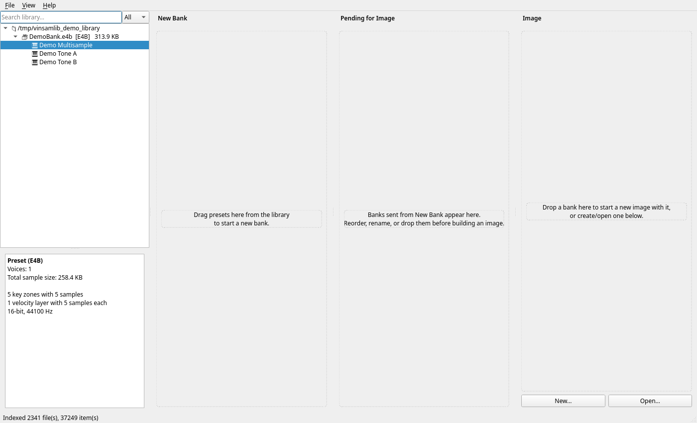
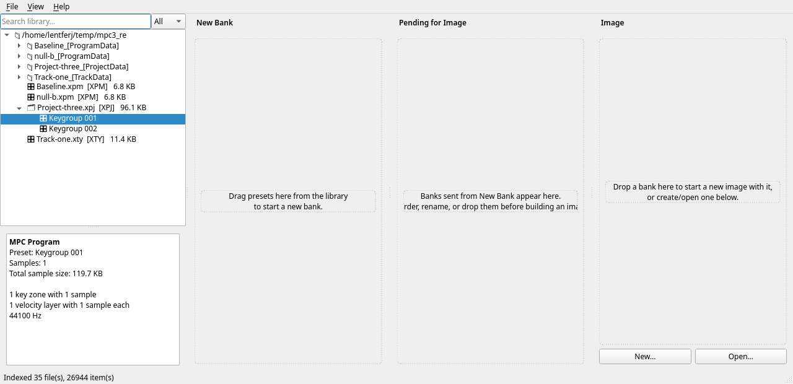
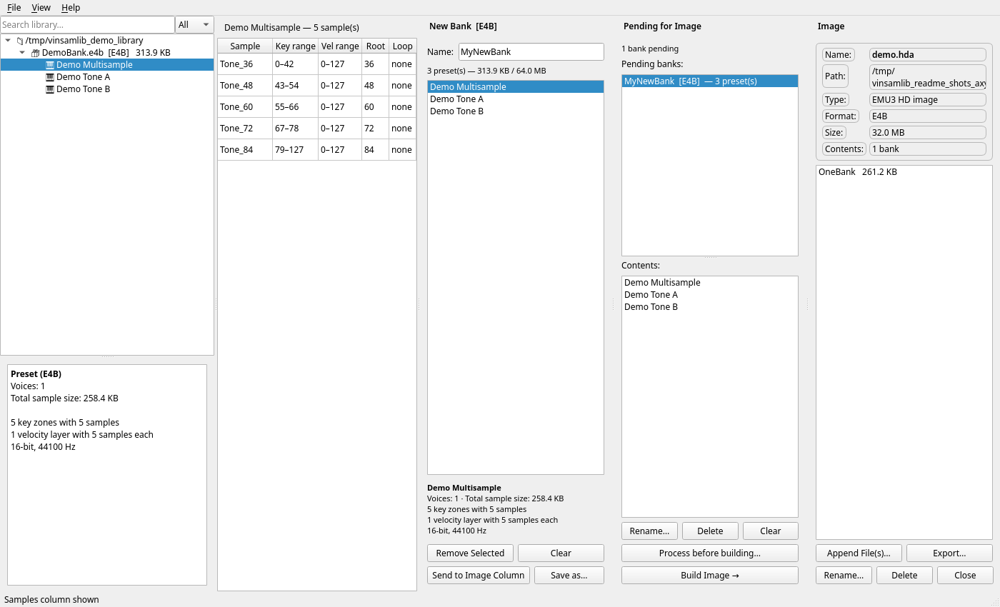
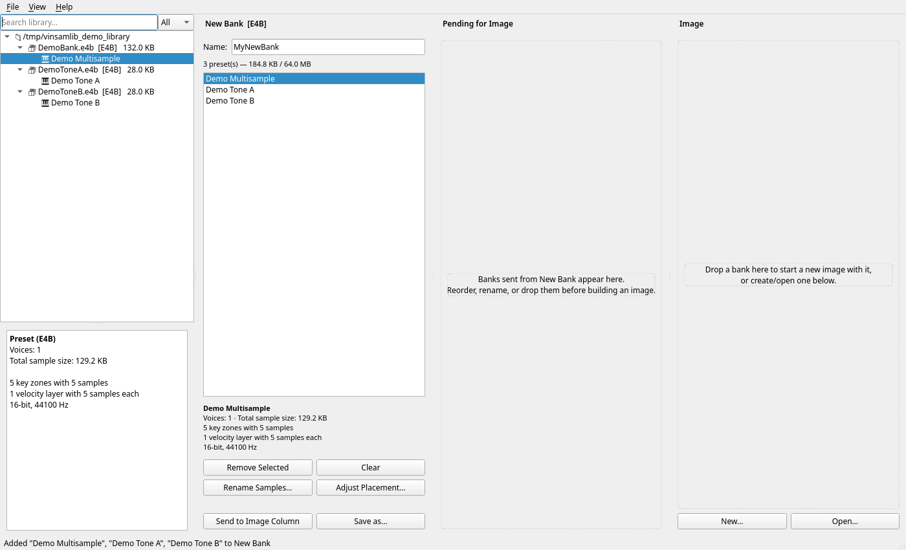
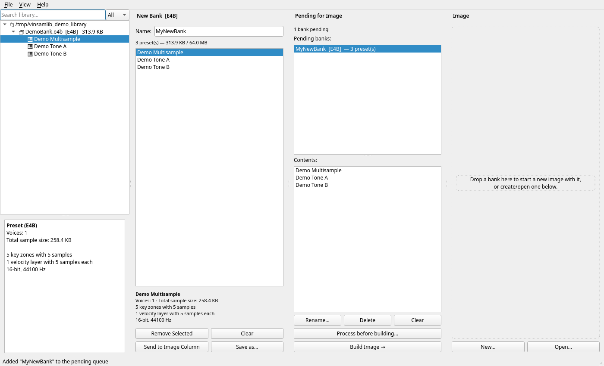
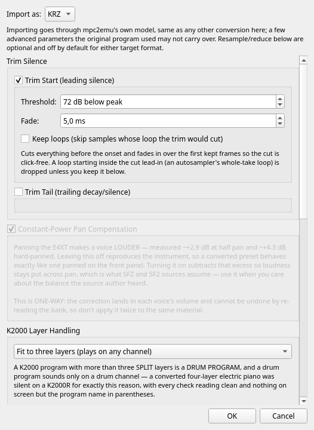
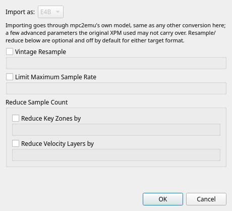
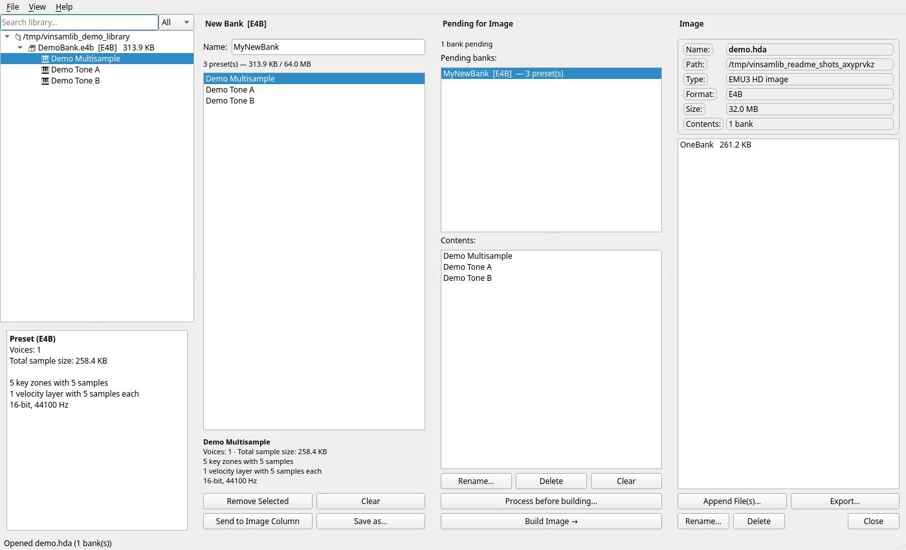
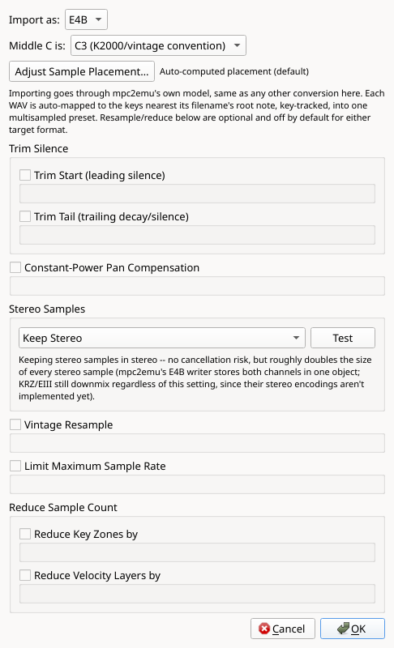
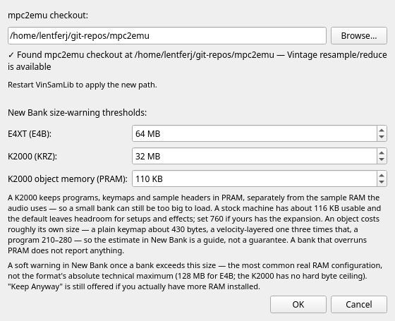

<!--
SPDX-License-Identifier: GPL-2.0-or-later
SPDX-FileCopyrightText: Copyright (C) 2026  VinSamLib contributors
-->

# VinSamLib

A librarian and bank builder for vintage sampler content — E-mu E4B
(Emulator IV / E4XT / EOS), E-mu EIII/ESI-32, and Kurzweil KRZ (K2000
series). Browse a whole library of banks, discs, and floppy images at
once; drag any preset or program straight into a new bank; queue
several banks for a build; write real, loadable disk images. Where
mpc2emu is available, you can also browse and import Akai MPC material
directly — a `.xpm` program, or a whole `.xpj` project one program at a
time — or run any existing preset through mpc2emu's vintage resample
/ sample-count reduction pipeline on its way into a bank.

> **Legal:** [DISCLAIMER.md](DISCLAIMER.md) · [LICENSE](LICENSE)

---

## ⚠️ Use at your own risk — back up first

VinSamLib is provided **as is, with absolutely no warranty and no
liability** for lost data, damaged hardware, corrupted media, or any
other harm arising from its use. You assume all risk. (Full terms:
[DISCLAIMER.md](DISCLAIMER.md).)

**Before you use this software, make good, current backups** of your
config, your library, and any existing disk images or floppy sets you
point it at. VinSamLib can rename, delete, and append entries on an
already-open disk image **in place**, and every Add/Remove Library
Folder action writes to your real config and search index immediately.
This isn't a hypothetical caution — an early ad-hoc test script during
this project's own development corrupted its author's real config and
search index once; see [DISCLAIMER.md](DISCLAIMER.md#real-data-risk--please-read-this-one)
for the honest account. Always keep an untouched copy of anything
irreplaceable, and test unfamiliar images on a spare SD card / floppy
before touching real hardware.

### If you built KRZ banks before 2026-08-03, check them

Two defects produced `.KRZ` files that parse cleanly, re-read correctly,
and look completely normal — the damage shows only on a K2000, or not at
all. Both are fixed; neither can be repaired in place, and nothing warns
you about a file you already have.

- **Multisample banks built before 2026-08-02** carry mpc2emu's keymap
  off-by-12 (its `791364a`). The K2000 sounds keymap entry `i` at MIDI
  key `i + 12`, and each zone was written 12 semitones from the key it
  was asked for, so the program plays **one sample key-tracked across
  the whole keyboard** instead of the right sample per key.
  Single-sample programs are unaffected.
- **Banks assembled before 2026-08-03** from a *compacted* source keymap
  were corrupted by VinSamLib itself: assembly walked keymap entries at
  a fixed stride that most real K2000 content doesn't use, overwriting
  tuning and subSample bytes. Compacted keymaps are the common case —
  1145 of 1584 in this project's own 201-file library.

To find affected files:

```
python3 tools/check_krz_banks.py ~/path/to/banks-or-images
```

It takes `.krz` files, directories, and disk/floppy images, reports what
it finds, and changes nothing. **The fix in both cases is to rebuild the
bank from its source material** with a current mpc2emu and VinSamLib.

If you still have the bank a KRZ was built *from*, add `--against`:

```
python3 tools/check_krz_banks.py --against SOURCE.krz ~/path/to/built
python3 tools/check_krz_banks.py --against SOURCE.e4b ~/path/to/built
```

That compares where each keymap splits the keyboard against what the
source calls for. A conversion may renumber samples, rename objects and
re-encode audio, but it must not move those split points — so this is an
exact check rather than the inference the plain scan has to make, and it
catches damage that isn't a clean 12-semitone shift. It is how this
project's own hardware-confirmation batch was verified after the fix, and
it caught the pre-fix version of the same banks, which had silently lost
a zone.

Either source format works: the `.krz` of a KRZ→KRZ conversion, or the
`.e4b` an E4B→KRZ one started from (that form needs mpc2emu configured).
A bank the given source can't account for is reported as *not compared*
rather than as a defect, and doesn't affect the exit code — give each
source its own run when a batch mixes them.

---

## AI assistance & human authorship

VinSamLib was built by its human author together with Anthropic's
**Claude**. The **ideas, the feature set, and every design correction**
came from the human author, arrived at through real, iterative use —
not a spec written up front. Claude assisted with **writing the
implementation and the test suite**. Full account, including specific
examples of corrections that shaped the final design, in
[DISCLAIMER.md](DISCLAIMER.md).

---

## Features

### What it is, and what needs mpc2emu

VinSamLib is a **GUI librarian**, not a batch converter — it sits on
top of [mpc2emu](https://github.com/lentferj/mpc2emu) (a separate,
sibling project) for every disk-*image* writer and every DSP routine,
and never edits or vendors mpc2emu's code. **Without mpc2emu installed
or configured, VinSamLib is still a full E4B/KRZ bank builder and
library browser**, not just a viewer: parsing, assembling, and saving
banks (New Bank → Save as…) needs no mpc2emu at all —
`banks/e4b.py`/`banks/krz.py` are entirely self-contained — and
browsing *existing* E4XT (EMU3) discs/HD images, K2000 ISO 9660 discs,
and **FAT12/16/32** floppies/discs/HDs (K2000 Gotek floppies, EOS FAT
`.hda`s) all work natively too, via `vfs/fatvol.py`'s own from-scratch
reader against the public FAT spec — no mpc2emu involved even to read.
EIII sits between the two: `banks/eiii.py` *reads* EIII/ESI banks with
no mpc2emu at all, but assembling one needs mpc2emu for the empty-bank
skeleton it reuses. What genuinely needs mpc2emu: **creating or
appending to any disk image** (every image kind's writer lives there,
E4B/EIII and KRZ alike), **E4B/EIII** preset-level zone/velocity/
bit-depth detail in the Detail pane (KRZ's own detail view is
self-contained), building an EIII bank at all, XPM import, sample-folder
import, and vintage conversion. Settings shows exactly which of these is unavailable and
why if mpc2emu isn't configured.

### Browse your whole library at once

Point VinSamLib at any number of folders — loose `.e4b`/`.KRZ` files,
EMU3 CD/HD images, ISO 9660 discs, FAT12/16/32 floppy or hard-disk
images, folders of Akai MPC programs and projects — and it lazily walks
the tree, showing banks, discs, folders, presets, and programs in one
unified Explorer. A background scanner indexes
everything into a local search database, so typing in the search box
finds a preset by name anywhere in the whole library, instantly, without
waiting for the tree to be expanded down to it.

### Build a new bank by dragging presets together

The New Bank column accepts presets/programs dragged from anywhere in
the library (or added via right-click), locks to whichever format the
first one came from, and shows a live, real size/count meter — computed
by actually assembling the selection, not an estimate. The E4XT's 128 MB / 1000-preset and the
K2000's 1000-program limits are hard, format-technical ceilings, always
enforced; a separate, lower, configurable-in-Settings byte threshold
(default 64 MB E4B / 32 MB KRZ) warns earlier, once a bank likely
exceeds *your own* hardware's actual RAM. Save the result directly to a
file, or queue it for image building.

### Queue several banks, then build

The Pending for Image column holds any number of banks-in-progress;
each can be renamed, reordered, and independently given its own mpc2emu
conversion recipe before "Build Image →" assembles all of them into the
currently-open (or about-to-be-created) disk image in one step.

### Manage disc/floppy images directly

The Image column creates any of mpc2emu's own image kinds (EMU3 CD,
EMU-fs or FAT hard disk for the E4XT; FAT16 CD/hard-disk or FAT12 Gotek
floppy for the K2000), or opens an existing one, and lets you append,
rename, delete, and export individual bank entries in place.

### Import an Akai MPC program, or browse a whole project

When mpc2emu is available: double-click or right-click any `.xpm` file
in the library, choose a target format and optional vintage conversion,
and it lands in New Bank as a single preset, ready to combine with
anything else.

An MPC **project** (`.xpj`) holds one program per keygroup track, so it
is browsed like a bank: expand it in the Explorer and each program shows
up as its own row, with the same zone summary a real preset gets. Import
one program, or the whole project at once.

### Run an existing preset through mpc2emu's vintage pipeline

Right-click any real preset or program in Explorer — E4B, KRZ or EIII —
for a second option, "Import via mpc2emu…", offering the exact same
resample/reduce dialog XPM import uses: apply the EMU Emulator II or
Emax I character, thin out an overly dense multisample, or convert to
another format entirely, without leaving VinSamLib. The dialog
defaults its target format to the preset's own source format, so
"same format, with options" (apply processing without converting) is
one click away — the same "Add" a plain drag would do, plus optional
processing.

### Turn a folder of WAVs into a multisampled preset

Also when mpc2emu is available: **File > Import Sample Folder…** takes a
folder of loose WAVs whose filenames carry their root notes
(`Piano C3.wav`, `Cello-A#2.wav`, `Pad_60.wav`) and auto-maps each one to
the keys nearest its root, producing a single playable multisample in New
Bank. Pick which octave convention the filenames use, or let it detect
that from the names themselves, and override any sample's key range or
root by hand — against an 88-key piano — when the automatic split isn't
what you wanted.

### Catch presets that will lose layers before the hardware does

Every E4B or KRZ conversion that runs through mpc2emu is checked for
presets that stack more voices on one *note* than the machine can sound —
a ceiling no size check can see, where the extra layers aren't quiet but
**stolen**. Both numbers behind it were measured on real hardware: a
stereo sample costs two voices, and the limit is per note (32 on an E4XT,
24 on a K2000R), not global polyphony. See [Voice budget
warning](#voice-budget-warning).

---

## Requirements

- Python 3.11 or later
- [PySide6](https://pypi.org/project/PySide6/) `6.11.1` (the only
  mandatory dependency — see `pyproject.toml`)
- A local checkout of [mpc2emu](https://github.com/lentferj/mpc2emu),
  for XPM import and vintage conversion. Without it, VinSamLib still
  runs as a browser/bank-builder; Settings will show exactly what's
  missing.

---

## Installation

### Installing VinSamLib

```bash
git clone <this repo's URL> vinsamlib
cd vinsamlib
pip install -e .
```

### Pointing it at an mpc2emu checkout

Then, if you want XPM import and vintage conversion: clone
[mpc2emu](https://github.com/lentferj/mpc2emu) somewhere on the same
machine, launch VinSamLib
(`vinsamlib` or `python -m vinsamlib.app`), open **File → Settings…**,
and point the "mpc2emu checkout" field at that directory. The status
line updates live as you type — it tells you separately whether the
path itself is a usable mpc2emu checkout, and whether the specific
modules the conversion feature needs are present. Changing the path
takes effect on the next restart (Python's own module cache holds
whichever mpc2emu modules were already imported from the old location).

---



*Explorer (left) with a bank expanded and a preset selected; the Detail
pane (below it) shows its condensed key-zone/velocity-layer/bit-depth
summary. (Screenshots throughout this manual use a small synthetic demo
library, not real commercial content.)*

## Quick Start

### Browse and build your first bank

1. **File → Add Library Folder…** and pick a folder containing E4B/KRZ/
   EIII banks, disc images, or floppy images (the file dialog remembers where
   you last added a folder from).
2. Expand it in the Explorer tree — banks and discs open lazily, so a
   large library doesn't stall on first click. Presets/programs inside a
   bank show a 🎹 icon.
3. Drag a preset into the **New Bank** column (or right-click it →
   "Add… to New Bank"). Drag a few more — from anywhere in the library,
   any format, as long as they all match the first one's format.
4. Give the bank a name in the **Name:** field — that's the filename a
   real E4XT or K2000 will show as the bank's own name.
5. Either **Save as…** to write the assembled bytes straight to a file,
   or **Send to Image Column** to queue it in **Pending for Image**.
6. In **Pending for Image**, click **Build Image →**. If no image is
   open yet, a "New Image" dialog asks what kind to create (matching
   your target hardware) and how big; otherwise it appends to whatever's
   already open in the **Image** column.
7. The **Image** column now shows your new bank as an entry on the disk
   image — copy that `.hda`/`.iso`/`.img` file to your ZuluSCSI/Gotek
   media the same way you would one built by mpc2emu's own CLI.

### Import an Akai MPC program (needs mpc2emu)

1. Add a library folder containing `.xpm` files, or use
   **File → Import MPC Program…** to pick one directly (it accepts
   `.xpm` programs, `.xty` tracks and `.xpj` projects).
2. Double-click the `.xpm` (or right-click it → **Import…**). A dialog
   asks for the target format (E4B, KRZ or EIII) and, optionally,
   vintage resample/reduce options.
3. The imported preset lands directly in **New Bank** — a `.xpm` or
   `.xty` always holds exactly one program, so there's nothing to
   choose between.

### Browse and import an MPC project (needs mpc2emu)

An MPC project (`.xpj`) carries one program per track, which makes it
the MPC's own equivalent of an E4B bank — so it is browsed like one
rather than being a single all-or-nothing import.

1. Add a library folder containing `.xpj` files. Each shows up as an
   expandable 🗂 row.
2. Expand it. Every program that carries sampled material — **keygroup
   and drum** — gets its own row, named after its track; selecting one
   shows the same key-zone / velocity-layer / sample-rate summary a real
   preset gets. MIDI, plugin, audio, CV and clip tracks reference no
   sample data at all and are not listed, and neither is a kit that was
   created but never filled.
3. Double-click a program (or right-click it → **Import…**) to bring
   just that one into **New Bank**, or right-click the project itself →
   **Import all programs of "…"…** to bring in every program at once,
   each named after its own track.
4. Expanding a project reads every sample it references, so the first
   expansion of a large one takes a moment; after that, clicking through
   its programs is instant. Projects are indexed by filename only — a
   background scan never parses them.



A project that can't produce anything is marked **(nothing to import)**
and greyed, with the reason in its tooltip, rather than expanding into
nothing. That covers both ways it happens: the project holds no keygroup
or drum program at all (the reason names the track kinds it does hold),
or every program it holds is an empty kit — 5 projects in the reference
backup are that second case.

That wording is deliberate, and distinct from **(failed to open)**,
which means the file is damaged or is not an MPC document. mpc2emu
raises the same exception type for both, so the two are told apart by
whether the container still reads as an MPC project — of the 181
projects in the reference backup, 168 list programs, 13 have nothing to
import, and none is broken. Both MPC 2.x projects (whose
programs live in a `<name>_[ProjectData]` folder next to the `.xpj`) and
MPC 3 ones are read the same way, and since mpc2emu `9a2c78b` both
generations gather drum programs as well as keygroup ones.

Program rows show the **whole** program name, which is often longer than
the name the import can keep: an E4B preset field holds 16 ASCII
characters, so `Poly Brass 193-Auto sampled` browses under that name and
arrives in New Bank as `Poly Brass 193-A`. For an MPC 2.x project the
full names come from the program files themselves, and only while each
preset can be matched to exactly one of them. Two programs whose names
truncate to the same 16 characters are unresolvable if either was
skipped, and then every row in that project falls back to the (short)
preset name — never a guess at which program a row shows. That costs
1 of the 90 projects here its full names.

**A project's data folder is mostly not sample content.** It holds one
`.xpm` per track, and only two kinds of program carry samples at all.
Measured on a real 571-file MPC One backup:

| kind | there | zones | samples | listed |
|---|---|---|---|---|
| Keygroup | 82 | 970 | 957 | yes — pitched, multisampled |
| Drum | 90 | 956 | 907 | yes — one-shot hits, one per key |
| MIDI / Plugin / Audio / CV / Clip | 399 | 0 | 0 | no, like a loose WAV |

**Drum kits convert** (mpc2emu `27ff6a4`): each pad becomes a one-key zone
whose root *is* its key, so every hit sounds at its native pitch instead of
key-tracking. Note the numbers above — in that backup the drum programs
carry roughly as much sampled material as the keygroup ones, and more per
file (a median of 12 samples against 5).

The remaining 399 reference no sample data whatsoever; mpc2emu refuses them
with a written-out reason, and VinSamLib doesn't list them. A file whose
kind can't be read from its header (an MPC 3 program, or anything unusual)
is always listed — the rule only acts on what declares itself otherwise.

⚠️ **An MPC 2.x drum kit can land on different keys than it had on the
MPC.** 2.x files don't record which key each pad plays (every `<PadNote>`
in mpc2emu's corpus is empty), so its pads are laid out on consecutive keys
from 36 (C1). Kits that used a General MIDI or hand-built layout come
through complete and at the right pitch, just re-ordered. MPC 3 files carry
a real pad map and are unaffected; the Detail pane says which case you're
looking at. Also note that a drum kit converted to **KRZ** fills the keys
between pads with a copy of the neighbouring hit — a K2000 locks up on
Master→Delete if a keymap has holes, so `krz_writer` fills them
deliberately.

If you indexed such a folder with an earlier version, **File → Rescan
Library** drops the stale entries from search.

### Run an existing preset through mpc2emu (needs mpc2emu)

1. Find a real E4B, KRZ or EIII preset/program anywhere in your library.
2. Right-click it → **Import via mpc2emu…** — the same dialog as XPM
   import. The target-format picker defaults to the preset's own
   format, so applying options without changing format is one click.
3. Pick your options (say, the Emulator II profile with a 30% key-zone
   reduction) and confirm; the converted result lands in New Bank
   alongside anything already there, labeled `"<name> (mpc2emu)"`.

### Import a folder of WAVs as a multisample (needs mpc2emu)

1. **File → Import Sample Folder…** and pick a folder whose WAV
   filenames carry their root notes (`Piano C3.wav`, `Pad_60.wav`).
2. Set **Middle C is:** to the convention those names use — `C3` for
   K2000-era material, `C4` for general MIDI — or leave it on
   **Auto-detect**. Choose a target format and any conversion options.
3. Optionally hit **Adjust Sample Placement…** to check the automatic
   key split against an 88-key piano and correct any sample's range or
   root by hand.
4. Confirm; the whole folder lands in **New Bank** as one multisampled
   preset named after the folder.

---

## The Manual

### Library & Search

**File → Add Library Folder…** registers a folder as a library root;
VinSamLib remembers all your roots across restarts and lists them
alphabetically by path in the Explorer tree (not by the order you added
them). **File → Remove Library Folder…** picks one from a list to
un-register (right-click a root directly in Explorer for the same
action without the picker) — this only stops VinSamLib from tracking
it; no files on disk are touched. **File → Rescan Library** re-runs the
background indexer over every current root, useful after you've added
new banks to a folder outside the app.

Every root is scanned in the background into a local SQLite index
(`index.db` in your user data directory) so the **search box** above the
Explorer tree can find a preset/program by name anywhere in the whole
library — including inside banks you've never expanded — the instant
you type. Search is **word-prefix matching**: each space-separated word
you type must *start* a word somewhere in the item's name, and multiple
words are AND-ed together (so `bass str` matches "Bassoon Strings" but
not "Bassoon Trumpet"). The format dropdown next to the search box
(`All`/`E4B`/`KRZ`/`EIII`/`MPC`) filters both the live tree and search
results to just that format. `MPC` covers all three Akai containers at
once — `.xpm` programs, `.xty` tracks and `.xpj` projects.

### Explorer

The Explorer pane shows either the lazy folder/bank tree (search box
empty) or a flat list of index-backed search hits (search box non-
empty) — both funnel into the same Detail pane and the same drag/context-
menu actions, so it doesn't matter which view you're using.

Right-click (or double-click) behavior depends on what you've selected:

| Item | Double-click | Right-click menu |
|---|---|---|
| Preset/program (one or many selected) | Add to New Bank | "Add … to New Bank"; **"Import via mpc2emu…"** (E4B, KRZ or EIII) — both work on a multi-selection |
| `.xpm` program or `.xty` track | Import (opens the conversion dialog) | "Import …" |
| `.xpj` project | Expand into its programs | "Import all programs of …" |
| One program inside a project | Import (opens the conversion dialog) | "Import …" |
| Library root (top-level folder) | — | "Remove … from Library…" |

Real **EIII / ESI-32** bank data — which commonly shares an EMU3-
filesystem disc alongside E4B content, and which older versions of this
app could only grey out — is browsable like any other bank now: its
presets expand in the tree, summarize in the Detail pane, drag into New
Bank, and save back out as a real `.e3x`. Anything still genuinely
unreadable (system/ROM entries, unrecognised content) is shown **greyed
out with its detected format label** rather than hidden or shown as
garbage. This is a deliberate choice: older discs commonly mix formats
on one volume, and hiding real content would look like a broken or
empty folder.

Folders that lead nowhere, on the other hand, are **not listed at all**.
A directory — or a folder inside a disc image — whose entire subtree
holds nothing this app can open is dropped rather than shown as a row
that expands into nothing: an MPC project's data folder holding only
loose WAVs, a folder of archives or spreadsheets, an empty `New Folder`
left behind on a disc. Both rules pull the same way: show everything
real, including the real-but-unreadable, and show nothing that is only a
dead end.

Three things deliberately survive that rule: your library roots, which
are always listed even when they turn out empty; a folder whose contents
could not be *read* at all (permissions), which keeps its row instead of
being called empty; and anything below a subtree too large to finish
checking. Loose WAVs are still importable as a multisample — **File →
Import Sample Folder…** picks a folder with a file dialog and never goes
through this tree.

### Detail Pane

Selecting a preset, program, MPC program or MPC project shows a
condensed summary rather
than a row-per-zone table (an earlier version showed the full table;
real presets can carry dozens of zones, and that much detail wasn't
actually useful at a glance): voice/keymap count, total unique sample
size, then two summary lines —

- **`N key zones with M samples`** — how many distinct key ranges the
  preset splits into, and how many distinct samples are referenced in
  total.
- **`N velocity layers with M samples each`** (or a range, `M–M2 samples
  each`, if it isn't uniform) — how many distinct velocity bands exist,
  and how many distinct samples fall within a single band.

— followed by bit depth and sample rate, read from the samples
themselves (not assumed): a single value if uniform across the preset,
a range if it mixes rates/depths. For KRZ, the sample rate is decoded
exactly from the K2000's own `samplePeriod` field
(`sample_rate = round(1e9 / samplePeriod)`), not guessed.

### Samples Pane



Hidden by default (**View → Show Samples Column**) — this is the
uncondensed counterpart to the Detail pane's summary: one row per zone,
with the sample name, key range, velocity range, root key, and loop
type. Useful when you need the exact per-zone breakdown the Detail
pane's summary intentionally leaves out.

### New Bank



The first preset you add locks the whole bank's format — E4B, KRZ or
EIII — shown right in the column header (`New Bank [E4B]`); a later drop
of a *different* format is rejected with a status message, matching mpc2emu's own
"no cross-format conversion in one step" rule (that's what "Import via
mpc2emu" is for).

**Duplicate detection** (View menu, both on by default): re-adding a
preset already in the bank is caught by content — the bank's file path
plus the preset's own index/id, not object identity, since a preset
reached through search is re-parsed fresh every time. **"Check for
Duplicate Presets"** turns the check off entirely if unchecked;
**"Prompt Before Skipping Duplicates"** switches a caught duplicate from
silently skipped to a yes/no confirmation (only meaningful while the
check itself is on).

The **size/count meter** below the name field recomputes by actually
assembling the current selection — not an estimate — debounced a
quarter-second after your last change. It enforces the real hardware
ceilings: **128 MB / 1000 presets** for E4B, **1000 programs** for KRZ,
**256 preset slots** for EIII/ESI-32 (a preset needing more than one
linked layer can use more than one slot, so "256 presets" isn't quite
the same as "256 slots" — see Known Limitations). Going over any of
these pushes the meter red and disables **Save as…**.

**Adding a preset that pushes you over the limit** shows a warning
dialog with two choices: **Keep Anyway** (leave the new item in place,
deal with it later) or **Undo Last Add** (revert to exactly the state
before that specific add — whichever it was: a drag, "Add to New Bank",
an XPM import, or an "Import via mpc2emu" conversion). This only fires
once per crossing — adding still more while already over won't nag you
again until you drop back under the limit.

Selecting an item in the list shows the same condensed Detail-pane-style
summary described above, computed in the background so large presets
don't stall the UI.

**Save as…** writes the exact assembled bytes to a file you choose.
**Send to Image Column** hands the current (bank, preset list, name)
recipe to **Pending for Image** — the recipe stays editable there, it
isn't a frozen copy.

### Pending for Image



Each entry in the queue can be **renamed**, **reordered** (drag within
the list), and given its **own mpc2emu conversion options** —
deliberately per *bank*, not a single global setting for the whole
queue, so you can, say, apply vintage resampling to one bank and leave
another untouched in the same build. (Per-*preset* granularity — mixing
converted and unconverted presets *within* one bank — is a deferred
future enhancement, not yet built; the underlying technique, assembling
temporary single-preset banks, is proven and documented for when it's
picked up.)

The conversion button is currently disabled for a KRZ- or EIII-format
queue (a scope decision, not a technical limitation any more — mpc2emu
can read both now too; per-bank conversion for either just hasn't been
wired up yet). Convert a KRZ/EIII preset individually via Explorer's
"Import via mpc2emu…" in the meantime.

**Build Image →** assembles every entry currently in the queue and hands
the results to the Image column — for E4B, KRZ, or EIII (EIII banks
build onto the exact same EMU3 CD/HD image kinds E4B does). Building
does **not** empty the queue — the same recipe can be rebuilt as many
times as you like (handy while iterating on conversion options).

### Convert Options dialog



Shared by "Import via mpc2emu", Pending's per-bank conversion, and XPM
import.

#### Import as: (target format)

The target-format picker at the very top. Only MPC import and "Import
via mpc2emu" show it (Pending's per-bank dialog doesn't — its
conversion button is still E4B-only, see Pending for Image above).
"Import via mpc2emu" defaults this picker to the preset's own source
format — "same format, with options" one click away — but you can
switch it to the other format just as easily. Switching it to KRZ
nudges (never forces) the max-sample-rate step to a sane default of
24000 Hz if you haven't already set one yourself — the K2000 only has
+1.46 semitones of up-pitch headroom at 44.1 kHz before wide key zones
start clamping, while the E4XT has no such ceiling.



If New Bank already has a format lock (it already contains at least one
preset), the picker is forced to that format and **greyed out** instead
of offered as a live choice — picking the other format would still run
a real (possibly slow) mpc2emu conversion, only to have it rejected
afterward once New Bank refuses to mix formats. Clear New Bank (or send
it to Pending first) to import as the other format instead.

#### Stereo Samples

What happens to stereo source samples, as a plain (always-visible) row
above the collapsible sections:

- **Keep Stereo** (the default) — stereo survives the whole pipeline
  into an **E4B or KRZ** output. **EIII** is the exception: its writer
  still downmixes regardless of this setting. KRZ stereo landed in
  mpc2emu on 2026-08-02 (`ff19e78`, hardware-confirmed on a K2000R,
  header 0 = left), so an older checkout will still downmix it — the
  capability arrives when you pull mpc2emu, not when you update
  VinSamLib.
- **Reduce to Mono — Mix / Left channel only / Right channel only** —
  a deliberate size reduction (it halves every stereo sample), in the
  same spirit as the vintage-fit options below it.

**Mix averages both sides, which cancels signal on decorrelated
stereo content** — and that is the common case, not an edge case:
across 247 real stereo E-mu samples mpc2emu measured a median channel
correlation of just 0.076. Picking one side instead can never cancel
anything; it only costs you the other channel.

The **Test** button checks the samples this conversion would actually
run on, and for Mix reports how many have decorrelated channels, names
the worst offender with its correlation, and suggests a side. If you
click OK on Mix without having tested, the dialog checks then and asks
you to confirm, offering **Go Ahead Anyway**, **Use Left/Right
Instead**, or **Go Back**. The suggested side comes from a rough
average-loudness comparison and is deliberately presented as a nudge,
not a verdict — mpc2emu investigated automating that choice and
[explicitly declined to ship it](https://github.com/lentferj/mpc2emu/commit/db5d599),
having found every signal it measured (dead channel, high correlation,
one-sided clipping) either never fired or came down to about 1 dB of
RMS asymmetry: "a coin-flip dressed up as intelligence". Getting the
side "wrong" costs a little level; Mix can cost you the audio.

Around that are the independent, collapsible sections below.

#### Trim Silence

**Trim Start (leading silence)** and **Trim Tail (trailing
decay/silence)**, each independently toggleable — an autosampler capture
typically wants its lead-in cut but its natural release left alone.
Trimming runs first in the pipeline, so every later step sees the
shortened samples at their real sizes.

**Threshold** is a *ceiling below the sample's own peak*, so the numbers
run the opposite way to most "amount" controls: the default of 72 dB
removes silence only, while a lower value such as 45 dB cuts into the
natural attack or release for a tighter sample. **Fade** is the short
linear fade at the new cut point that keeps it click-free.

By default, a sample whose loop lies in the region being cut (an
autosampler's whole-take loop) has that loop **dropped**, leaving a clean
one-shot. **Keep loops** instead skips the trim for those samples,
preserving the loop at the cost of the silence.

This is useful for MPC Auto Sampler output in particular: the MPC's own
"Auto Trim Start" only moves a playback *marker* inside the MPC project,
which is gone once the sample is exported as a bare WAV — so the audible
lead-in silence is back in anything VinSamLib imports.

#### Constant-Power Pan Compensation

**E4B only** — greyed out for KRZ and EIII targets. For the EIII that is
still for want of a measurement. For the **K2000 it is no longer**: its
law was measured on 2026-08-02 and is constant power like the E4XT's, but
hard pan raises the live channel **+3.0 dB there against the E4XT's
+4.5**, so the two machines cannot share one correction and applying this
curve to a KRZ target would bake in the wrong number. (mpc2emu does now
write KRZ pan itself, for mono layers, into the high nibble of HOB `0x53`
byte 14 — so a source preset's pan reaches a K2000, just uncorrected.)

Panning the E4XT makes a voice **louder**: mpc2emu measured +2.88 dB at
half pan and +4.32 dB hard-panned, and confirmed the curve is identical
at every volume (0.00/0.00/0.21 dB spread across 0/−6/−12) and unchanged
by the filter — which is what makes a single correction curve valid at
all.

Left **off** (the default), a converted preset behaves exactly like one
panned on the E4XT's own front panel. Turned **on**, the excess is
subtracted from each voice's volume so loudness stays put across pan —
roughly what SFZ and SF2 sources assume, so it restores the balance the
source author actually heard rather than the instrument's behaviour.

**The correction itself is hardware-verified**, not just the problem it
fixes: mpc2emu played two banks built from one source differing only in
this flag through an E4XT and measured both.

| pan | off (hardware law) | on (constant power) |
|---|---|---|
| 0.25 | +1.07 dB | −0.40 dB |
| 0.50 | +2.88 dB | −0.36 dB |
| 0.75 | +3.94 dB | −0.28 dB |
| 1.00 | +4.32 dB | −0.47 dB |

Worst deviation from flat is **0.47 dB**, against 4.32 dB uncompensated —
a 9× reduction, and close to the ±0.25 dB predicted beforehand. What's
left is not error but quantisation: the E4B volume field steps in about
0.767 dB, so a correction can only ever land on the nearest step.

Note this is **one-way**, which is why it's opt-in rather than an
always-on correction like the cutoff and zone-gain fixes: those fix a
*mapping* and mpc2emu's parser inverts them exactly on read-back, whereas
this alters the *material*. It lands in the volume byte where it is
indistinguishable from a volume you set deliberately, so re-reading the
bank cannot undo it and applying it twice to the same material drifts
further each time.

#### Vintage Resample

Pick `EMU Emulator II` (8-bit µ-law companded, 27,777 Hz — the defining
lo-fi grit) or `EMU Emax I` (12-bit linear, 27,500 Hz — cleaner).
**Apply bandpass coloring** (on by default) simulates the output filter
stage; unchecking it isolates the raw bit/rate reduction. **Keep
gain-staged (hot) level** skips restoring each sample to its original
peak level afterward, leaving the louder, gain-staged level the DSP
works at internally.

#### Limit Maximum Sample Rate

An independent step (not gated behind Vintage Resample also being on):
clean-downsamples anything above the chosen rate. Only ever
downsamples, never up.

"Clean" became considerably cleaner in mpc2emu on 2026-08-02
(`6bccce9`): the old two-pole prefilter was far too gentle for the job
and let content above the new Nyquist fold back audibly — a full-scale
sweep that should have come back silent aliased at −5.3 dB, and the same
softness dulled the passband 3 dB at 8 kHz. It is now a
Blackman-windowed sinc: −89.4 dB and flat to 9.5 kHz. This is the
default path for KRZ output, so it applies to more banks than the
opt-in name suggests. Vintage Resample is untouched — its aliasing is
the point.

#### Reduce Sample Count

**Reduce Key Zones by** / **Reduce Velocity Layers by**, each an
independent percentage slider. The percentage is how much to
**remove**, not a target to shrink *to* — 30% removes ~30%, keeping
~70% spread evenly across the range (matches mpc2emu's own CLI
semantics and wording exactly). With small counts, rounding means the
actual fraction removed won't always be exact.

#### Behavior shared by every section

The dialog grows as you check more sections, and the title/wording adapts
to which feature opened it (e.g. "Import via mpc2emu" vs. "Import MPC
Program")
so it never says the wrong thing. Expanding everything wants more height
than a window is allowed to occupy, so the sections scroll once they run
out of room; the OK/Cancel buttons sit outside that and stay reachable.

Leaving every section untouched is recognised as a genuine no-op, and
when the source and target formats also match, the mpc2emu round trip is
skipped entirely rather than needlessly re-encoding the bank through
mpc2emu's model.

#### Voice budget warning

Every conversion that goes through mpc2emu — XPM import, sample-folder
import, "Import via mpc2emu", and a per-bank conversion in Pending for
Image — is checked afterwards for presets that stack more voices on a
**single note** than the hardware will sound, and warns naming the preset,
the note, and the velocity.

This is a separate ceiling from size, so no size check can catch it: a
preset can be tiny in bytes and still over budget. Over the limit the
extra voices are not merely quiet, they are **stolen**, and which layers
survive is the hardware's choice, so an over-budget preset plays back
differently than it looks.

Two numbers behind it, both measured on hardware: a **stereo sample costs
two voices**, and the ceiling is per note — about **32 voices** on an
E4XT, rather than its 128-voice global polyphony (32 voices on each of
four separate keys all sound). It bites hardest since stereo became the
default — presets that used to be downmixed now carry twice the voice
cost.

The fixes are both in this same dialog: **Reduce Velocity Layers**, or any
Stereo Samples method other than Keep Stereo, which halves every stereo
zone's cost. The warning is never blocking: the bank is written either
way, and the count is taken *after* mono reduction and the zone reducer
have run, so it describes the file you actually got.

**E4B and KRZ.** The K2000R was measured on 2026-08-02 and its ceiling is
**24 voices per note** — its entire polyphony, so 12 stereo layers reach
it. The plateau held identically at velocity 100, 45 and 25, which is how
voice stealing was told apart from output clipping. **EIII** is the one
target still unchecked: no per-note limit has been measured on it, and
mpc2emu leaves it out of its limit table rather than warn on a guess.
VinSamLib doesn't keep a list of which formats have a ceiling — it checks
whatever mpc2emu has measured, so EIII starts being covered the day that
number exists.

### Image Column



**New…** creates a fresh image; the dialog offers every kind mpc2emu
itself can write:

| Kind | Format | Produces | Extension |
|---|---|---|---|
| EMU3 CD | E4B or EIII | ZuluSCSI CD-ROM image (EMU3 filesystem) | `.iso` |
| EMU3 HD (native EMU filesystem) | E4B or EIII | SCSI hard disk, all EOS versions | `.hda` |
| EMU3 HD (FAT) | E4B or EIII | SCSI hard disk, EOS 4.7+ only | `.hda` |
| K2000 FAT16 | KRZ | CD or hard disk (universally compatible) | `.hda`/`.iso` |
| K2000 ISO 9660 | KRZ | CD, needs K2000 OS v3.87+ | `.iso` |
| K2000 Gotek floppy | KRZ | FAT12 floppy for a Gotek/FlashFloppy | `.img` |

E4B and EIII share the exact same EMU3-filesystem container (real
commercial E4XT discs commonly mix both on one volume), so any "EMU3"
kind above accepts either — each image still locks to whichever format
its first bank was, the same one-format-per-image rule E4B/KRZ already
follow.

**Open…** opens an existing image (its kind is auto-detected from the
real bytes, not assumed from the file extension). Once open, dragging a
bank in (or a Pending build landing on it) **appends** to it in place —
no rebuild, no external tools — except floppy images, which aren't
appendable and must be built whole each time.

Right-click an entry for **Rename…**, **Delete**, or **Export…** (write
just that one bank back out to a standalone file) — all in-place
operations on the real image file (via a temp-copy-then-replace, never a
from-scratch rebuild), confirmed with a dialog before anything
destructive happens.

### MPC Import (XPM / XTY / XPJ)

The MPC saves the same keygroup program inside three containers, and
mpc2emu reads all three: a bare program (`.xpm`), a track (`.xty`) and a
project (`.xpj`). The first two hold **exactly one** program, so
importing one always produces exactly one preset in New Bank, never a
whole separate bank of its own. Their display name uses the **original
filename**, not the preset's internal name: E4B truncates preset names to
16 hardware characters, so several distinctly-named XPMs sharing a long
common prefix would otherwise all show up under the same collapsed name.

A **project** is different, because it holds one program per keygroup
track — the MPC's own equivalent of a bank. It is expandable in the
Explorer rather than importable in one gulp, and its programs can be
imported one at a time or all at once. Here the filename is the *shared*
part and the program names are what distinguish them, so those are what
New Bank shows.

Two consequences worth knowing:

- **Expanding a project parses it**, which means reading every WAV it
  references (a real one can pull tens of MB). That happens once per
  project, on expansion, and never during a background library scan —
  the index records projects by filename only, so search finds the
  project but not its programs by name.
- Programs are **imported, not dragged**. A real preset can be dragged
  into New Bank because it already is E4B/KRZ/EIII content; an MPC
  program only becomes one by going through a conversion, so its row
  offers the same Convert Options dialog a `.xpm` does.

### "Import via mpc2emu"

Generalizes MPC import's exact same pipeline to a preset or program you
already have natively in your library — E4B, KRZ or EIII, any of the
three can be the source and any can be the target: right-click it,
choose options, and get a converted copy in New Bank — without exporting
anything or leaving the app. This covers exactly the cases a plain "Add"
can't: converting to a *different* format (source format ≠ New Bank's
current format), or applying resample/reduce while keeping the *same* format
(source format = target — the dialog defaults to this). Converting the
*same* source preset more than once (e.g. to compare two different
option sets) gives each result a distinguishable name —
`"<name> (mpc2emu)"`, then `"<name> (mpc2emu) 2"`, `"3"`, and so on —
since two different conversions of one preset are deliberately **not**
treated as duplicates by New Bank's dedup check (only an identical
repeat would be), so nothing else would otherwise keep them apart in
the list.

**Works on a multi-selection too** — select several presets in Explorer
and choose "Import *N* presets via mpc2emu…"; one Convert Options dialog
applies the same chosen options to every preset in the selection, each
converted and added in turn (not one dialog per preset). If the
selection spans presets from different source banks, the target-format
picker just falls back to defaulting on E4B rather than guessing —
pick explicitly in that case.

### Sample Folder Import



**File > Import Sample Folder…** turns a folder of loose WAVs into a real
native E4B, KRZ or EIII bank — no XPM, no existing preset, nothing to
export first. Each file's **root note comes from its filename**
(`Piano C3.wav`, `Cello-A#2.wav`, `Pad_60.wav`), and mpc2emu's
`parse_sample_dir` maps every sample to the keys nearest its own root,
splitting at the midpoints between adjacent roots and key-tracking across
each span. Files that end up sharing a root — a folder of drum one-shots,
where no filename names a pitch and everything lands on the default root
— are spread onto consecutive keys instead, one per key, each root moving
with its sample so nothing plays transposed. The result is one
multisampled preset, landing straight in New Bank under the folder's
name — exactly the way a `.xpm` import lands one preset, never a whole
bank of its own.

**Targeting KRZ:** multisampled KRZ output was broken on real hardware
until mpc2emu's 2026-08-02 keymap fix — every zone landed 12 semitones
from the key it was asked for, so the program played one sample across
the whole keyboard. **Folders you imported to KRZ before then need
re-importing**, and the bottom octave (keys 0–11) is unreachable on a
K2000 whatever placement you set. See [Known
Limitations](#conversion-sources-and-scope).

It is offered **only from the File menu**, never from an Explorer
right-click. Unlike an `.xpm` file or an already-native preset, a folder
of loose WAVs isn't something you browse to and recognize as "one
importable thing" — you pick a folder and decide about it case by case.

The dialog is the [Convert Options dialog](#convert-options-dialog):
the same target-format picker, and the same Trim Silence,
Constant-Power Pan Compensation, Stereo Samples, Vintage Resample and
reduction sections, all behaving identically — plus two controls that
only make sense for a bare WAV folder.

**Which WAVs are readable** widened on 2026-08-02 (mpc2emu `07aea81`,
`780eab3`): 32-bit float and 32-bit integer PCM, and
`WAVE_FORMAT_EXTENSIBLE` — the usual encoding a modern DAW writes for
24-bit — used to be rejected outright, taking the file out of the
import with an error. All three now load. FLAC is deliberately not
supported and won't be; convert it beforehand.

**Middle C is:** decides where MIDI 60 falls for filenames that name an
octave — `C3` (the K2000 and most vintage samplers), `C4` (general MIDI),
`C5`, or **Auto-detect**, which is mpc2emu's own CLI default and takes a
majority vote across the folder's filenames. An XPM never needs this: its
zones already carry real MIDI key numbers, whereas `C3` in a filename is
just text until something decides which octave numbering wrote it.

**Adjust Sample Placement…** opens the editor described below; the label
beside it reads *Auto-computed placement (default)* until you accept an
override, then *Custom placement set for N sample(s)*. Stereo Samples'
**Test** button works here too, checking the actual WAVs for stereo
content. Both re-read the folder using whatever **Middle C is:** is
selected at that moment, not whatever it was when the dialog opened.

#### Sample Placement


One row per sample — **Sample / Low / Root / High** — beside an 88-key
piano that colors each sample's range in that sample's own color, the
same color in both places. Colors are assigned once from the initial
low-to-high order and never change afterwards, so a sample stays
recognizable even as rows move: rows are kept sorted low to high and
**reorder live** when an edit changes their relative order.

Two kinds of trouble tint the note fields. **Overlapping ranges** turn
light red. A row that **can never sound** — low above high, or a root
outside its own range — turns a stronger red. Both are **warnings only**
and never block OK: real hardware samplers do use deliberately
overlapping zones for layering, so that stays your judgment call, and
keeping the same rule for the unplayable case means one bad row can't
trap you in the dialog. OK applies exactly what is shown; Cancel leaves
any override you had already accepted in place.

The spin boxes accept the **full MIDI range 0–127** — the piano's A0–C8
span is a drawing limit, not an editing one, so a zone can legitimately
extend past the drawn keyboard. Note names are labelled using the
convention picked above; on **Auto-detect** the labels fall back to
C4 = 60, since the parser resolves its real offset internally without
reporting it. That affects the **labels only**, never the actual key
numbers written to the bank.

### Settings



**File → Settings…** — the mpc2emu checkout path, with a live status
line: whether the path itself is even a usable mpc2emu checkout, and
separately whether the specific modules the conversion feature needs
are present (a checkout could exist but be an incompatible or partial
version). Changing the path needs a restart to take effect.

**New Bank size-warning thresholds** (bottom of the dialog, pictured
above) — one editable field in MB each for E4B and KRZ, defaulting to
**64 MB / 32 MB** (an EIII New Bank reuses the E4B field: EIII banks load
on the same E4XT hardware, via its backward-compatibility loader, so a
third near-identical spinbox would say nothing new): the most common
real E4XT/K2000 RAM configurations,
*not* the format's own absolute technical maximum (128 MB for E4B; the
K2000 has no hard byte ceiling at all, only its 1000-program limit —
see New Bank above). This is a **soft**
warning New Bank's size meter and over-limit dialog use to flag a bank
that's probably too big for *your* actual hardware, before you find out
the hard way — raise it if you genuinely have more RAM installed;
"Keep Anyway" in the over-limit dialog still lets you build past it
either way. Takes effect immediately on OK, no restart needed.

### Keyboard Shortcuts

**Delete** removes the current selection wherever a "Remove"-style
action exists: New Bank's list, the Image column's list, and both the
main queue and the per-bank contents list in Pending for Image.

---

## Known Limitations

### EIII / ESI-32

| Feature | Status |
|---|---|
| EIII / ESI-32 bank format | ✅ readable and buildable (`.e3x`/`.esi`) — browse, summarize, combine into a New Bank, Save as…, and convert to/from E4B and KRZ. No reference implementation existed anywhere, so this is a from-scratch RE effort, corpus-verified by round-tripping 600 real banks out of the author's own discs |
| EIII banks on a disk image | ✅ EIII banks can now be sent to Pending for Image and built onto a real EMU3 CD/HD image the same way E4B banks are (mpc2emu's EIII writer/`iso_builder` fix, hardware-confirmed 2026-07-28, made this possible — see `build/images.py`'s `append_banks()`). Per-bank "Process before building…" isn't wired up for EIII yet, same scope decision as KRZ (see below) |
| Writing the `.esi` (ESI-32) variant | ⚠️ `banks/eiii.py`'s `assemble()` supports it, but nothing in the UI exposes the choice — Save as… always writes the `.e3x` variant (which the E4XT's backward-compatibility loader also reads) |
| EIII banks with shared preset link-chains | ⚠️ an EIII preset stacks layers by link-chaining preset slots, and several presets can share one chain tail. Assembling gives each its own copy, so selecting *every* preset of a few unusually dense commercial banks can exceed the 256-slot format ceiling even though the source bank fit — 2 of 600 corpus banks. Save as… reports it rather than writing a corrupt bank; drop a few presets to get under it |

### Conversion sources and scope

| Feature | Status |
|---|---|
| KRZ as a conversion *source* | ✅ mpc2emu's own KRZ reader (added 2026-07-27, corpus-verified against 593 real files) made this possible — KRZ presets/programs can now be converted the same way E4B ones can, via Explorer's "Import via mpc2emu…" |
| Multisample KRZ banks built before 2026-08-02 are wrong | ⚠️ **fixed upstream, but existing files must be rebuilt.** The K2000 sounds keymap entry `i` at MIDI key `i + 12`, and mpc2emu wrote each zone into `entry[key]` instead of `entry[key - 12]`, so a multisampled program played **one sample key-tracked across the whole keyboard** instead of the right sample per key. A four-tone test bank measured 440/466/494/524 where it should have given 440/550/660/880 — indistinguishable from a single stretched sample, which is what it was. Fixed in mpc2emu `791364a` (hardware-confirmed against a commercial bank whose entries begin at 48 and which sounds from key 60 up). **Any multisampled KRZ bank you built before that is affected and cannot be repaired — rebuild it.** Nothing warns about old files: the `.KRZ` looks correct and re-reads correctly, because the reader carried the matching error. Single-sample programs are unaffected, as are E4B and EIII |
| KRZ zones cannot reach keys 0–11 | ⚠️ a consequence of the same `i + 12` rule: with `basePitch` 0 a keymap's 128 entries cover keys 12–139, so the bottom octave of the keyboard cannot be addressed at all and a zone asked for from key 0 starts at 12. Relevant when using **Sample Placement** to set an explicit low key for a KRZ target |
| Per-bank KRZ/EIII conversion in Pending for Image | ⚠️ per-preset conversion via Explorer works for both now; the whole-bank "Process before building…" button in Pending is still E4B-only — a scope decision, not a technical limitation, since it hasn't been wired up for KRZ/EIII queues yet |
| Per-preset conversion granularity | ⚠️ conversion options are per-*bank* in Pending for Image; mixing converted/unconverted presets within one bank is a documented, not-yet-built enhancement |
| Some coverage-remapped KRZ presets can't be re-processed | ⚠️ a real mpc2emu bug (`writers/krz_writer.py`, tracked in mpc2emu's own TODO): a preset needing the octave-slice-stack "coverage remap" rebuild can crash on write when reprocessed; most real content is unaffected — VinSamLib surfaces the real error if it happens rather than silently failing |

### Disk images

| Feature | Status |
|---|---|
| Gotek floppy images | ⚠️ create-only — not appendable (a real FAT12 floppy constraint, not a bug) |

### Zone and velocity reduction

| Feature | Status |
|---|---|
| Aggressive `reduce_velocity_layers_pct` can collapse key-range coverage | ⚠️ a real mpc2emu `zone_reducer` finding from hardware confirmation (2026-07-28): a 75% reduction on a dense real multi-zone preset collapsed coverage from the full keyboard down to a single surviving 4-semitone zone, rather than thinning velocity layers while preserving spread across keys — disproportionate for what's meant to be a velocity-only reduction. Not yet root-caused; tracked in mpc2emu's own TODO. Lower percentages (confirmed up to 40-50%) behave as expected |

### Stereo and mono reduction

| Feature | Status |
|---|---|
| Stereo samples — E4B | ✅ kept in stereo end-to-end (Convert Options → Stereo Samples, default **Keep Stereo**), or reduced to mono on purpose as a vintage-fit/size step. **Hardware-confirmed 2026-07-31** on a real E4XT, and confirmed by *measurement* rather than by ear: a stereo bank loads and plays as stereo with the correct channel order (a left-only key measured L 440 Hz / R silent, rms 0.092 vs 0.00006; a split-pitch key measured 440 Hz left / 659 Hz right — mpc2emu `0868233`). This was the one part of the E4B stereo RE that no offline work could settle |
| Stereo samples — KRZ | ✅ since mpc2emu `ff19e78` (2026-08-02) — **hardware-confirmed on a K2000R**: two planar `Soundfilehead` blocks, the `LYR[8]` `0x20` stereo marker, a keymap id in *both* `CAL` slots (one per channel), and the HOB `0x52`/`0x53` channel routing; a 440/660 sample measured 440 on the left output and 660 on the right, so header 0 is the left channel. Read side too — 51 byte-exact KRZ→KRZ round trips, and mono output is byte-identical to before. **Needs a current mpc2emu checkout:** an older one downmixes, and nothing on VinSamLib's side can tell you which you have |
| Stereo samples — EIII | ⚠️ **downmixed**, whatever the Stereo Samples setting says: `writers/eiii_writer.py` calls `ensure_mono()` explicitly rather than emitting stereo. The setting still controls *how* (Mix vs. picking a side) for E4B and KRZ; for an EIII target it's mpc2emu's own averaging downmix. VinSamLib only passes the choice through and cannot fix this on its own side — the work is upstream, and KRZ is the precedent for how it gets done |
| Hard-panned voices lose the stereo image on hardware | ⚠️ an E4XT behavior, corrected against real measurement 2026-07-31 (mpc2emu `0868233`): per-voice **pan mono-sums** a stereo voice onto the pan position — it does not balance it and does not discard a channel, as previously believed from a by-ear report. At hard left, the left output carries both channels' content and the right is silent. So a preset kept in stereo but carrying an extreme per-voice pan costs the stereo **image**, not the content; keeping stereo voices centred is the fix. VinSamLib never sets pan itself — it only passes through whatever the source preset already had |
| Averaging downmix (Mix) can cancel signal | ⚠️ inherent to averaging, not a bug: decorrelated channels partially or fully cancel when summed, and across 247 real stereo E-mu samples mpc2emu measured a median channel correlation of only 0.076. The Convert Options dialog's **Test** button and its OK-time confirmation exist to surface this per-sample before you commit; **Left**/**Right** avoid it entirely |

### Hardware confirmation

| Feature | Status |
|---|---|
| Real hardware confirmation — E4B / EIII | ✅ **confirmed 2026-07-28** on real E-mu E4XT hardware (via ZuluSCSI): building a bank, sending it through Pending for Image, and building/appending it onto a real EMU3 disk image — including the new EIII-on-image capability — all load and play correctly, for every vintage resample profile and reduce combination in the project's own HW confirmation matrix (`tests/manual_hw_convert_matrix.py`) |
| Real hardware confirmation — KRZ / K2000R | ⏳ **pending** — not yet tested by loading a VinSamLib-built image onto a real K2000R. Considered **very likely to work**: VinSamLib's KRZ image writing goes entirely through mpc2emu's own K2000 disk builders (no VinSamLib-specific KRZ write logic of its own), and mpc2emu's KRZ writer already carries its own separate, real K2000R/Gotek hardware confirmation (filters, envelopes, LFOs — see [mpc2emu's own DISCLAIMER.md](https://github.com/lentferj/mpc2emu/blob/main/DISCLAIMER.md)) — this row will be updated once VinSamLib's own K2000R test is actually run |

---

## Project Structure

```
vinsamlib/
├── app.py                      # Entry point
├── config.py                   # Config load/save, mpc2emu path checks
├── mpc2emu_bridge.py            # Lazy sys.path proxies onto an external mpc2emu checkout
├── banks/
│   ├── e4b.py                  # Byte-verbatim E4B container reader/assembler
│   ├── krz.py                  # Byte-verbatim KRZ container reader/assembler
│   ├── eiii.py                 # Byte-verbatim EIII/ESI container reader/assembler
│   └── summary.py              # Zone/velocity/bit-depth/sample-rate summaries for the UI
├── build/
│   ├── convert.py              # mpc2emu resample/reduce wrapper (ConversionOptions)
│   ├── xpm_import.py           # MPC .xpm/.xty/.xpj -> E4B/KRZ/EIII, sharing convert.py's pipeline
│   ├── sampledir_import.py     # A folder of WAVs -> one multisampled preset
│   └── images.py               # create_image()/append_banks() over mpc2emu's writers
├── vfs/                        # Read-side filesystem support mpc2emu itself never needed
│   ├── base.py                 # Volume/Entry protocol every reader implements
│   ├── emu3.py                 # EMU3 filesystem (E4XT CD/HD images)
│   ├── fatvol.py               # FAT12/16/32 (K2000 floppy/HD images)
│   ├── iso9660.py               # Standard ISO 9660 (K2000 CD images)
│   ├── localdir.py              # A plain directory, behind the same protocol
│   └── detect.py               # Format sniffing/dispatch
├── index/
│   ├── db.py                   # SQLite + FTS5 search index
│   └── scanner.py               # Background library scanner
└── ui/
    ├── main_window.py           # Menu bar, pane wiring
    ├── models.py                # The lazy library tree (QAbstractItemModel) + format filter
    ├── explorer_pane.py          # Library tree + search
    ├── search_resolve.py         # Turns a bare index hit back into a live tree node
    ├── detail_pane.py            # Condensed preset/program info
    ├── samples_pane.py           # Per-preset sample list
    ├── bank_pane.py              # New Bank column
    ├── pending_pane.py           # Pending for Image column
    ├── image_pane.py             # Image column
    ├── convert_options_dialog.py # Shared resample/reduce dialog
    ├── format_convert_dialog.py  # + target-format picker, subclasses the above
    ├── sampledir_import_dialog.py # + octave convention and sample placement
    ├── sample_placement_dialog.py # Per-sample key ranges over a piano keyboard
    ├── piano_keyboard.py         # The keyboard widget that dialog draws on
    ├── note_naming.py            # MIDI number <-> note name, per octave convention
    ├── dnd.py                    # The preset drag payload shared by tree and results
    ├── workers.py                # One thread pool, one signal bridge, for all background work
    └── settings_dialog.py        # mpc2emu path configuration

tools/
└── check_krz_banks.py          # Scans built KRZ banks for the two silent defects
                                 # described under "If you built KRZ banks before…"
```

---

## License and Third-Party Sources

This project is released under the **GNU General Public License v2.0 or
later (GPL-2.0-or-later)** — see [`LICENSE`](LICENSE).

**mpc2emu is a runtime dependency, not vendored code.** VinSamLib
deliberately never edits or copies mpc2emu's source — every E4B/KRZ/EIII
bank *writer* and every DSP routine (vintage resample, key-zone/
velocity-layer reduction, XPM parsing) this app exposes is mpc2emu's own
code, loaded from a separate checkout at runtime. mpc2emu carries its
own, considerably longer credit chain for the format knowledge behind
those writers (emu3fs, emu3bm, KurzFiler, ConvertWithMoss, libgig, and
more) — see [mpc2emu's own README](https://github.com/lentferj/mpc2emu/blob/main/README.md#license-and-third-party-sources)
directly rather than this file duplicating it.

VinSamLib's own format *readers* (the byte-verbatim E4B/KRZ/EIII
container readers, and the EMU3/FAT12/16/32/ISO 9660 filesystem readers) are
original code informed by public specifications and by mpc2emu's own
separately-licensed reverse-engineering work — see [`LICENSE`](LICENSE)
for the specific, per-file attributions.

The GUI itself is built on **[PySide6](https://pypi.org/project/PySide6/)**
(Qt for Python), © The Qt Company, licensed under the LGPL.

---

*E-mu, Emulator, EOS are trademarks of Creative Technology Ltd. ·
Kurzweil is a trademark of Young Chang Co. Ltd. · Akai MPC is a
trademark of inMusic Brands Inc.*
